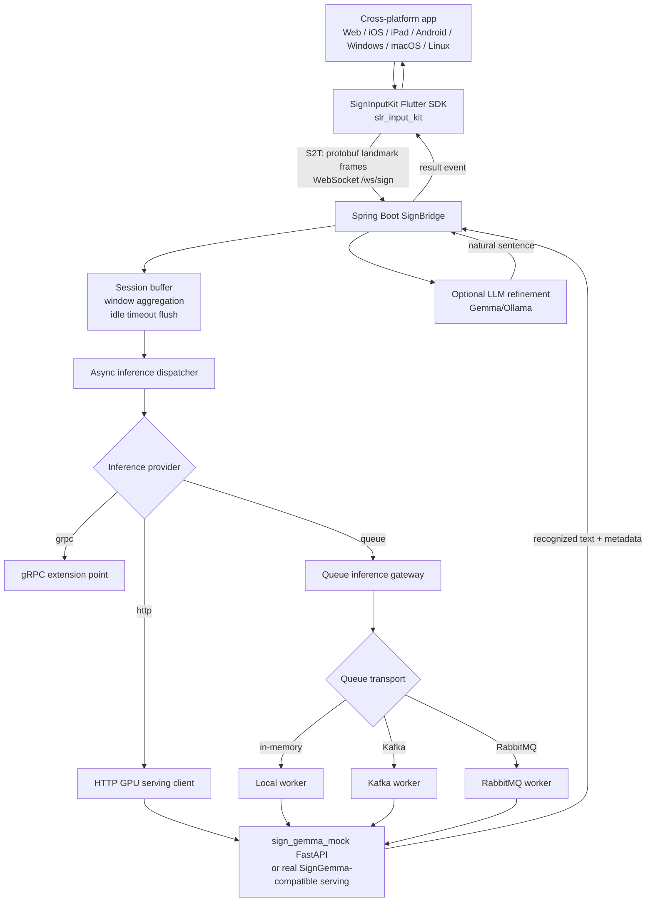
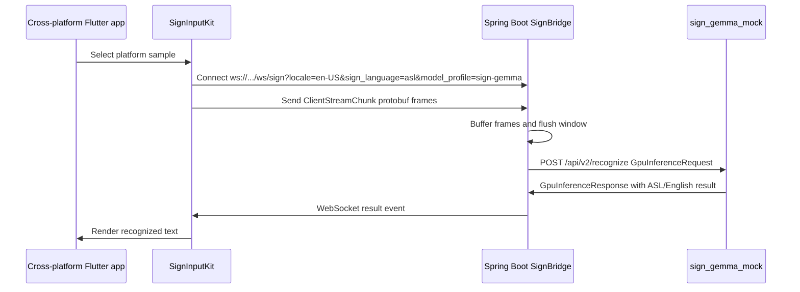
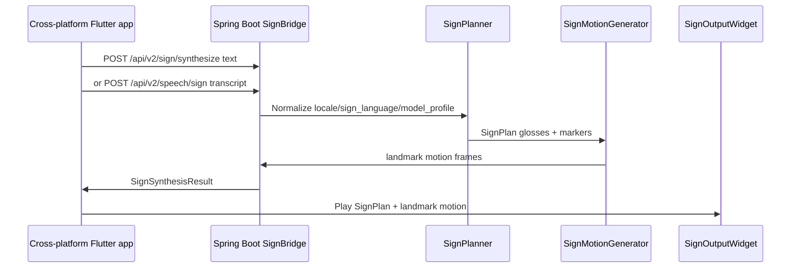
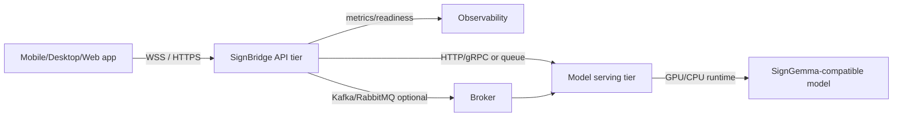

# SignBridge 프로젝트 아키텍처

이 문서는 LinguaSign / SignBridge / SignInputKit 예제와 운영 확장 구조를
한 장의 기준 아키텍처로 정리합니다. 현재 SignGemma 공식 checkpoint와 입력
spec이 공개적으로 확정되지 않았기 때문에, 실행 가능한 예제는
`sign-gemma` model profile을 SignGemma-compatible ASL mock serving 계약으로
사용합니다.

## 전체 구성

## SignGemma 예제 흐름

## Text/Speech-to-Sign 흐름

## 런타임 책임

| 영역 | 책임 | 현재 구현 | 교체/확장 지점 |
| --- | --- | --- | --- |
| App | 플랫폼별 UI, 카메라 권한, 입력/재생 UX | Flutter sample gallery | 제품 앱, kiosk, accessibility input |
| SignInputKit | WebSocket client, protobuf frame 전송, playback widget | `slr_input_kit` | 실제 camera landmark extractor |
| SignBridge | 세션, buffering, routing, API/SPI, readiness/metrics | Spring Boot | 인증, tenant routing, 운영 정책 |
| Model serving | S2T inference | `sign_gemma_mock` | 공식 SignGemma-compatible server |
| Synthesis | T2S/STS mock motion | `SignPlanner`, `MockSignMotionGenerator` | 실제 planner, avatar/skeleton renderer |
| Queue | 비동기 inference transport | in-memory/Kafka/RabbitMQ skeleton | 운영 broker, DLQ, retry |
| LLM refinement | raw keyword 보정 | Gemma/Ollama SPI | 언어별 prompt/model policy |

## 배포 관점

개발 환경에서는 앱, Spring Boot, `sign_gemma_mock`을 한 머신에서 실행할 수
있습니다. 운영 환경에서는 SignBridge와 model serving을 분리하고, GPU model
서버나 broker worker를 독립적으로 확장하는 구성이 안전합니다.

## 검증 훅

- `./scripts/verify_docker_http_stack.sh`는 HTTP compose stack을 build하고
  readiness, profile discovery, T2S, WebSocket protobuf streaming을 검증합니다.
- `./scripts/regenerate_protobuf.sh`는 `schema/landmark.proto`에서 Python과
  Flutter protobuf 산출물을 재생성합니다. Spring Java 출력은 Gradle build에서
  생성합니다.
- `/swagger-ui.html`과 `/v3/api-docs`는 profile discovery, synthesis,
  readiness, health, metrics 예제를 포함한 OpenAPI 문서를 제공합니다.
