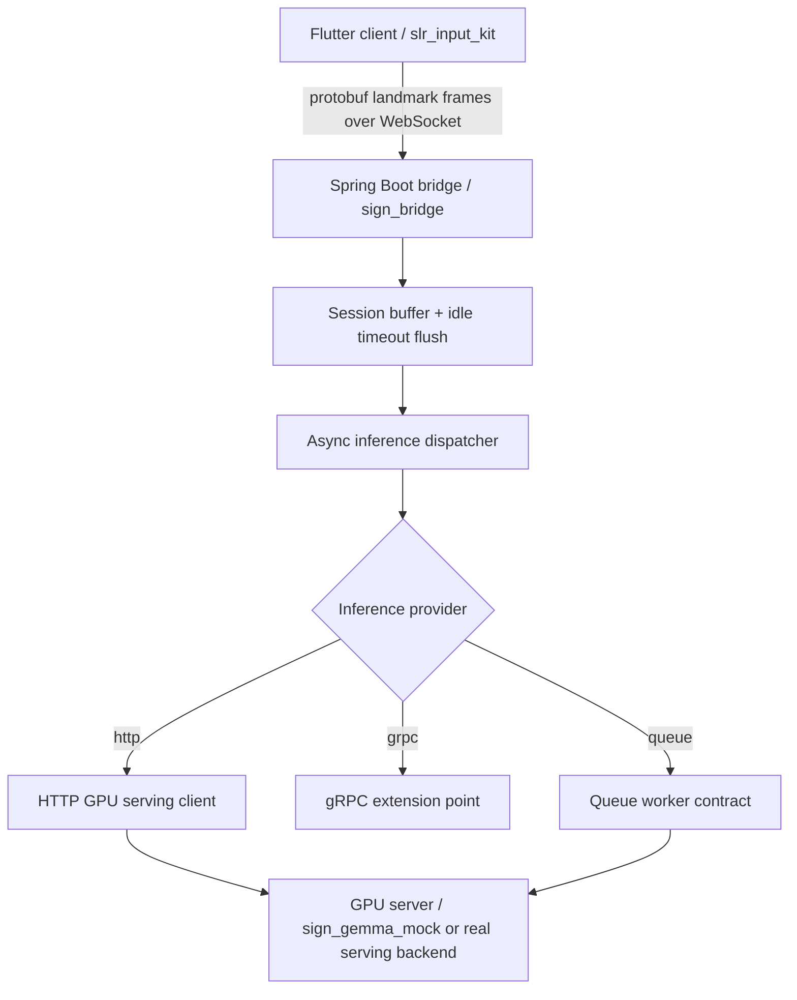

# MJ Sign

Sign language recognition prototype focused on a cloud-oriented V2 pipeline:

- Flutter client plugin in `slr_input_kit/`
- Spring Boot bridge in `sign_bridge/`
- Python mock GPU server in `sign_gemma_mock/`
- Shared protobuf schema in `schema/`

- [한국어 문서](./README_ko.md)
- [English README](./README_en.md)

## Current Architecture



## Implemented Backend Capabilities

- Binary protobuf intake over WebSocket at `/ws/sign`
- Session-aware buffering and frame window aggregation
- Idle timeout based auto flush
- Async inference dispatch with per-session in-flight protection
- Provider routing for `http`, `grpc`, and `queue`
- HTTP serving contract via `GpuInferenceRequest` and `GpuInferenceResponse`
- Queue worker contract via `QueueInferenceTask`, `QueueInferenceResult`, `QueueInferenceTransport`, `QueueWorkerBackend`, and broker-style transport skeletons
- Operational endpoints:
  - `GET /internal/healthz`
  - `GET /internal/readyz`
  - `GET /internal/metrics`

## Provider Model

The bridge selects its inference transport using `sign.gpu.provider`.

- `http`: active implementation through `HttpInferenceGateway`
- `grpc`: extension stub through `GrpcInferenceGateway`
- `queue`: queue-backed worker contract through `QueueInferenceGateway`

The queue provider now has a second-level transport router:

- `in-memory`: executable local transport
- `kafka`: broker-style skeleton
- `rabbitmq`: broker-style skeleton

The worker contract remains executable today through the in-memory transport and an HTTP-backed worker backend, while the Kafka and RabbitMQ transports define the integration seams for real broker clients.

## Repository Layout

- `slr_input_kit/`
  Flutter package with the public client API, demo widget, protobuf models, and Sign Bridge client.
- `sign_bridge/`
  Spring Boot WebSocket bridge, buffering logic, async dispatch, provider routing, queue worker contract, and ops endpoints.
- `sign_gemma_mock/`
  FastAPI mock serving backend that follows the current HTTP inference contract.
- `schema/`
  Shared protobuf schema used by Flutter, Java, and Python.

## Key Configuration

Main backend settings live in `sign_bridge/src/main/resources/application.properties`.

- `sign.gpu.provider`
- `sign.gpu.base-url`
- `sign.gpu.infer-path`
- `sign.gpu.health-path`
- `sign.gpu.grpc-target`
- `sign.gpu.queue-topic`
- `sign.gpu.queue-transport`
- `sign.gpu.queue-request-topic`
- `sign.gpu.queue-result-topic`
- `sign.gpu.queue-consumer-group`
- `sign.gpu.queue-exchange`
- `sign.gpu.queue-routing-key`
- `sign.gpu.queue-timeout-ms`
- `sign.window.min-frames`
- `sign.window.idle-timeout-ms`
- `sign.async.core-pool-size`

## Local Development

1. Start the mock GPU server:

```bash
cd sign_gemma_mock
python main.py
```

2. Start the Spring bridge:

```bash
cd sign_bridge
./gradlew bootRun
```

3. Analyze or run the Flutter package:

```bash
dart analyze slr_input_kit
```

## Local Broker Environments

### Kafka

Start Kafka:

```bash
docker compose -f docker-compose.kafka.yml up -d
```

Run the bridge with the Kafka profile:

```bash
cd sign_bridge
./gradlew bootRun --args='--spring.profiles.active=kafka'
```

This activates:

- `sign.gpu.provider=queue`
- `sign.gpu.queue-transport=kafka`
- `sign.gpu.queue-broker-mode=spring`

### RabbitMQ

Start RabbitMQ:

```bash
docker compose -f docker-compose.rabbitmq.yml up -d
```

Run the bridge with the RabbitMQ profile:

```bash
cd sign_bridge
./gradlew bootRun --args='--spring.profiles.active=rabbitmq'
```

This activates:

- `sign.gpu.provider=queue`
- `sign.gpu.queue-transport=rabbitmq`
- `sign.gpu.queue-broker-mode=spring`

### Shutdown

```bash
docker compose -f docker-compose.kafka.yml down
docker compose -f docker-compose.rabbitmq.yml down
```

## Integrated Local Stacks

Use these when you want the broker, mock GPU, and Spring bridge to come up together:

```bash
docker compose -f docker-compose.stack.kafka.yml up -d
docker compose -f docker-compose.stack.rabbitmq.yml up -d
```

The integrated bridge containers override broker host settings so the queue provider can talk to `kafka:9092` or `rabbitmq:5672` inside Docker, while the mock GPU stays reachable at `http://mock-gpu:8000`.

## End-to-End Queue Verification

The repository now includes executable verification scripts that validate the real local queue worker flow, including serializer or converter wiring, worker consumption, reply production, and the WebSocket-to-queue-to-GPU round trip.

Kafka:

```bash
./scripts/verify_kafka_stack.sh
```

RabbitMQ:

```bash
./scripts/verify_rabbitmq_stack.sh
```

What these scripts do:

- start the integrated Docker stack
- wait for `/internal/healthz` and `/internal/readyz`
- send a binary protobuf WebSocket payload to `/ws/sign`
- verify that a final inference response comes back through the queue-backed worker flow
- assert that metrics report at least one completed inference

Set `KEEP_STACK=1` if you want the stack left running after verification.

## DLQ and Retry Samples

Broker-specific retry and dead-letter policy examples are provided here:

- `sign_bridge/src/main/resources/application-kafka-dlq.properties`
- `sign_bridge/src/main/resources/application-rabbitmq-dlq.properties`

These files are sample baselines for:

- retry topic or queue naming
- DLQ naming
- max attempt and backoff values
- listener defaults that are usually paired with broker-side retry handling

They are intentionally documented as samples, not production-final values.

## Verification

Backend verification currently runs with:

```bash
cd sign_bridge
./gradlew test
```

For full local integration coverage with real broker containers, run the queue verification scripts above.

## Status

This repository is no longer accurately described as only a local FFI pipeline. The active implementation direction is a cloud bridge architecture with structured inference providers, async buffering, operational visibility, and a queue-ready worker contract.
