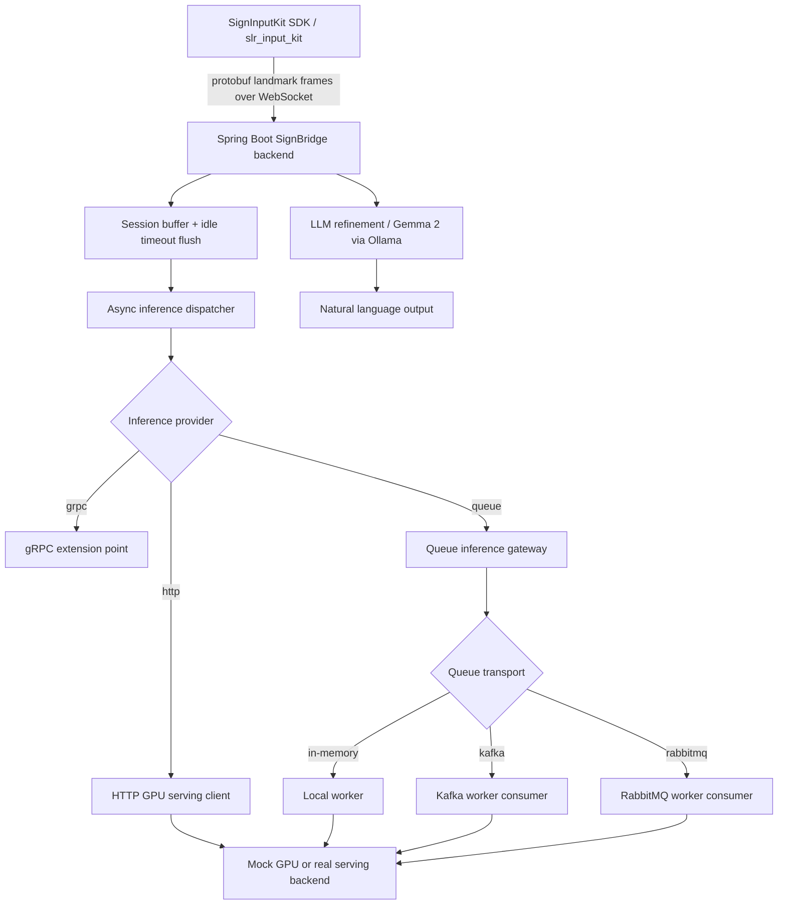

# SignBridge

SignBridge는 LinguaSign 제품을 구동하는 크로스 플랫폼 수어 입력 플랫폼입니다. SignInputKit SDK가 손/포즈/얼굴 landmark frame을 WebSocket protobuf로 전송하고, Spring Boot SignBridge backend가 세션 버퍼링, idle timeout flush, GPU serving provider 라우팅, queue worker 흐름, LLM 문장 보정을 담당합니다.

> 브랜딩 기준: 프로젝트/플랫폼명은 **SignBridge**, 홍보용 제품명은 **LinguaSign**, SDK 브랜드는 **SignInputKit**입니다. 현재 Flutter package 이름은 호환성을 위해 `slr_input_kit`으로 유지합니다.

- [English README](./README_en.md)
- [한국어 상세 문서](./README_ko.md)
- [프로젝트 홍보 문서 (KO)](./PROJECT_PROMOTION_KO.md)
- [Project Promotion (EN)](./PROJECT_PROMOTION_EN.md)
- [API / SPI Reference](./API_SPI_REFERENCE.md)
- [BE-Model 표준 프로토콜](./MODEL_PROTOCOL.md)
- [T2S / STS Synthesis Design (KO)](./SIGN_SYNTHESIS_DESIGN_KO.md)
- [T2S / STS Synthesis Design (EN)](./SIGN_SYNTHESIS_DESIGN.md)
- [언어별 모델 추가 가이드](./LANGUAGE_MODEL_GUIDE.md)
- [SignGemma 조사 노트 (KO)](./SIGN_GEMMA_RESEARCH_KO.md)
- [SignGemma Research Notes (EN)](./SIGN_GEMMA_RESEARCH.md)
- [LLM Integration Prompt](./PROMPT_LLM_INTEGRATION.md)
- [개선 계획 및 리뷰](./REVIEW_AND_ENHANCEMENT_PLAN.md)

## 왜 SignBridge인가

- 수어 입력을 일반 텍스트 필드처럼 붙일 수 있는 SignInputKit의 `SlrInputWidget` 중심 구조입니다.
- Android, iOS, iPad, Web, Windows, macOS/OSX, Linux 샘플 흐름을 한 예제 앱에서 비교할 수 있습니다.
- 실제 GPU serving 전까지 `sign_gemma_mock`으로 WebSocket, queue, serializer/converter, metrics 경로를 검증할 수 있습니다.
- `http`, `grpc`, `queue` provider 분기와 Kafka/RabbitMQ transport 골격이 있어 운영 구조로 확장하기 쉽습니다.
- Gemma 2 기반 LLM 보정 레이어로 원시 수어 키워드를 자연스러운 한국어 문장으로 다듬는 방향을 포함합니다.

## 현재 아키텍처


```mermaid
graph TD
    A["SignInputKit SDK / slr_input_kit"] -->|"protobuf landmark frames over WebSocket"| B["Spring Boot SignBridge backend"]
    B --> C["Session buffer + idle timeout flush"]
    C --> D["Async inference dispatcher"]
    D --> E{"Inference provider"}
    E -->|"http"| F["HTTP GPU serving client"]
    E -->|"grpc"| G["gRPC extension point"]
    E -->|"queue"| H["Queue inference gateway"]
    H --> I{"Queue transport"}
    I -->|"in-memory"| J["Local worker"]
    I -->|"kafka"| K["Kafka worker consumer"]
    I -->|"rabbitmq"| L["RabbitMQ worker consumer"]
    F --> M["Mock GPU or real serving backend"]
    J --> M
    K --> M
    L --> M
    B --> N["LLM refinement / Gemma 2 via Ollama"]
    N --> O["Natural language output"]
```

## 저장소 구성

- `slr_input_kit/`: SignInputKit SDK의 현재 Flutter package, SignBridge client, protobuf model, 플랫폼별 샘플 앱
- `sign_bridge/`: Spring Boot WebSocket bridge, provider routing, async buffer, queue worker, health/readiness/metrics, LLM translation API
- `sign_gemma_mock/`: FastAPI 기반 mock GPU serving backend
- `schema/`: Flutter, Java, Python이 공유하는 protobuf schema
- `scripts/`: Kafka/RabbitMQ 통합 스택 검증 스크립트

## 구현된 주요 기능

- `/ws/sign` WebSocket binary protobuf landmark intake
- 세션 단위 buffering, frame window aggregation, idle timeout 자동 flush
- 세션별 in-flight 보호가 있는 async inference dispatch
- `sign.gpu.provider=http|grpc|queue` 기반 provider routing
- HTTP GPU serving contract: `GpuInferenceRequest`, `GpuInferenceResponse`
- 언어 독립 BE SPI: `InferenceContext` 기반 `locale`, `sign_language`, `model_profile` 표준화
- Queue worker contract: `QueueInferenceTask`, `QueueInferenceResult`, `QueueInferenceTransport`, `QueueWorkerBackend`
- Kafka/RabbitMQ serializer, converter, worker consumer, result publication path
- 운영 endpoint: `GET /internal/healthz`, `GET /internal/readyz`, `GET /internal/metrics`
- Gemma 2/Ollama 기반 `POST /api/v2/translate` LLM 문장 보정
- T2S/STS 1차 계약: `POST /api/v2/sign/synthesize`, `POST /api/v2/speech/sign`, mock `SignPlan + landmark motion`
- T2S/STS SPI: `SpeechToTextAdapter`, `SignPlanner`, `SignMotionGenerator`, `SignSynthesisProvider`
- Flutter `SignOutputWidget` 및 Web `SignSynthesisPreview` 기반 synthesis playback stub

## 빠른 시작

Mock GPU 서버:

```bash
cd sign_gemma_mock
python main.py
```

Spring bridge:

```bash
cd sign_bridge
./gradlew bootRun
```

Flutter 샘플 앱:

```bash
cd slr_input_kit/example
flutter run
```

샘플 앱은 기본적으로 deterministic demo landmark source를 사용합니다. 실제 카메라 landmark extractor가 없어도 bridge 연결, protobuf streaming, 최종 결과 이벤트 흐름을 바로 확인할 수 있습니다.

## 플랫폼별 샘플

플랫폼 샘플은 [slr_input_kit/example/lib/samples](./slr_input_kit/example/lib/samples)에 분리되어 있고, [slr_input_kit/example/lib/main.dart](./slr_input_kit/example/lib/main.dart)에서 갤러리 형태로 실행됩니다.

| Platform | Sample profile | Run command | 기본 bridge URL |
| --- | --- | --- | --- |
| Android | `android_sample.dart` | `flutter run -d android` | `ws://10.0.2.2:8080/ws/sign` |
| iOS | `ios_sample.dart` | `flutter run -d ios` | `ws://127.0.0.1:8080/ws/sign` |
| iPad | `ipad_sample.dart` | `flutter run -d <ipad-device-id>` | `ws://127.0.0.1:8080/ws/sign` |
| Web | `web_sample.dart` | `flutter run -d chrome` | `ws://localhost:8080/ws/sign` |
| Windows | `windows_sample.dart` | `flutter run -d windows` | `ws://127.0.0.1:8080/ws/sign` |
| macOS/OSX | `macos_sample.dart` | `flutter run -d macos` | `ws://127.0.0.1:8080/ws/sign` |
| Linux | `linux_sample.dart` | `flutter run -d linux` | `ws://127.0.0.1:8080/ws/sign` |

실제 제품에서는 `DemoLandmarkFrameSource`를 `CameraLandmarkFrameSource` 또는 MediaPipe/ML Kit/온디바이스 모델 기반 extractor로 교체하면 됩니다.

## 언어 및 수어 모델 라우팅

Flutter client는 기본적으로 현재 platform locale을 기준으로 WebSocket URL에 `locale`, `sign_language`, `model_profile`, `protocol_version`을 붙입니다. 플랫폼별 active keyboard layout은 Flutter에서 일관되게 노출되지 않으므로, 앱에서 키보드 언어를 알 수 있는 경우 `SignLanguageContext`로 명시 override할 수 있습니다.

영어 locale은 BE에서 기본적으로 `asl`과 `sign-gemma` model profile로 정규화됩니다. BE 내부 SPI는 언어와 무관하게 `InferenceContext`를 함께 받는 동일한 형태이며, model backend에는 [MODEL_PROTOCOL.md](./MODEL_PROTOCOL.md)에 정의된 표준 JSON envelope가 전달됩니다.

API/SPI 경계는 [API_SPI_REFERENCE.md](./API_SPI_REFERENCE.md)에 정리되어 있고, 새 언어 모델을 추가하는 절차와 Sign Gemma 호환 model spec은 [LANGUAGE_MODEL_GUIDE.md](./LANGUAGE_MODEL_GUIDE.md)를 기준으로 따르면 됩니다.

SignGemma 공개 정보와 landmark 지원 범위는 [SIGN_GEMMA_RESEARCH_KO.md](./SIGN_GEMMA_RESEARCH_KO.md)와 [SIGN_GEMMA_RESEARCH.md](./SIGN_GEMMA_RESEARCH.md)에 따로 정리했습니다.

## Provider 설정

주요 설정은 [sign_bridge/src/main/resources/application.yml](./sign_bridge/src/main/resources/application.yml)에 있습니다.

- `sign.gpu.provider`
- `sign.language.default-locale`
- `sign.language.sign-language-by-locale-language`
- `sign.language.model-profile-by-sign-language`
- `sign.gpu.base-url`
- `sign.gpu.infer-path`
- `sign.gpu.health-path`
- `sign.gpu.grpc-target`
- `sign.gpu.queue-transport`
- `sign.gpu.queue-request-topic`
- `sign.gpu.queue-result-topic`
- `sign.gpu.queue-consumer-group`
- `sign.gpu.queue-exchange`
- `sign.gpu.queue-routing-key`
- `sign.gpu.queue-timeout-ms`
- `sign.window.min-frames`
- `sign.window.idle-timeout-ms`
- `sign.async.core-pool-size`

## Broker 로컬 실행

Kafka:

```bash
docker compose -f docker-compose.kafka.yml up -d
cd sign_bridge
./gradlew bootRun --args='--spring.profiles.active=kafka'
```

RabbitMQ:

```bash
docker compose -f docker-compose.rabbitmq.yml up -d
cd sign_bridge
./gradlew bootRun --args='--spring.profiles.active=rabbitmq'
```

Mock GPU와 bridge까지 포함한 통합 스택:

```bash
docker compose -f docker-compose.stack.http.yml up -d
docker compose -f docker-compose.stack.kafka.yml up -d
docker compose -f docker-compose.stack.rabbitmq.yml up -d
```

## 통합 검증

Kafka queue flow:

```bash
./scripts/verify_kafka_stack.sh
```

RabbitMQ queue flow:

```bash
./scripts/verify_rabbitmq_stack.sh
```

English/ASL `sign-gemma` profile flow:

```bash
./scripts/verify_english_asl_profile.sh
```

백엔드 단위 테스트:

```bash
cd sign_bridge
./gradlew test
```

Flutter 패키지 분석:

```bash
dart analyze slr_input_kit
```

## 운영 준비 체크포인트

- 실제 GPU serving backend의 `/healthz`, `/infer` contract를 mock과 동일하게 맞춥니다.
- WebSocket은 운영에서 WSS로 노출하고 session ID 수명과 인증 정책을 정합니다.
- Kafka/RabbitMQ profile에는 DLQ, retry, backoff, consumer group 정책을 환경별로 튜닝합니다.
- `/internal/metrics`를 Prometheus 또는 운영 대시보드로 연결합니다.
- LLM 보정은 final/high-confidence 결과에만 적용해 latency와 비용을 관리합니다.

## 현재 상태

SignBridge는 단순 로컬 FFI 실험이 아니라, 크로스 플랫폼 수어 입력 UI와 클라우드/edge GPU serving bridge를 연결하는 구조로 발전했습니다. 다음 단계는 실제 landmark extractor와 실제 GPU 모델 serving을 붙여 demo landmark source를 LinguaSign 제품 수준 입력 파이프라인으로 교체하는 것입니다.
