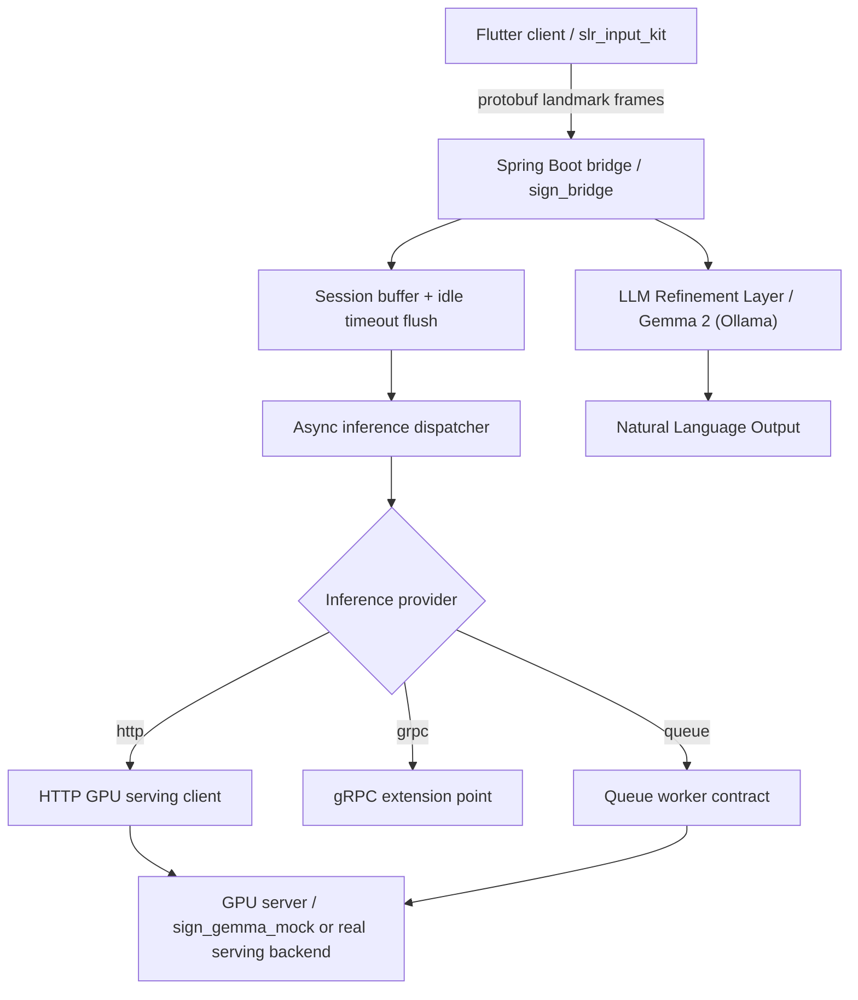

# MJ Sign

This project is a cloud-oriented V2 prototype for sign language recognition.

- Flutter client plugin: `slr_input_kit/`
- Spring Boot bridge: `sign_bridge/`
- Python mock GPU server: `sign_gemma_mock/`
- Shared protobuf schema: `schema/`

## Current Architecture



## LLM-Powered Translation (V2 Extension)

The project now includes an LLM-based refinement layer that transforms raw sign language keywords (e.g., "I", "rice", "eat") into natural, grammatically correct sentences using **Gemma 2**.

- **Kotlin Migration**: The `sign_bridge` module has been modernized to Kotlin and uses `build.gradle.kts`.
- **Spring AI**: Integrated via the Spring AI Ollama starter for local LLM communication.
- **Prompt Engineering**: Includes specialized system prompts for sign-to-sentence translation and refinement.
- **REST API**: New endpoint `POST /api/v2/translate` for keyword refinement.

## Backend Features Implemented

- Protobuf landmark intake over `/ws/sign`
- Session-aware buffering and frame window aggregation
- Idle-timeout based automatic flush
- Async dispatch with per-session in-flight protection
- Provider routing for `http`, `grpc`, and `queue`
- HTTP serving contract through `GpuInferenceRequest` and `GpuInferenceResponse`
- Queue worker contract through `QueueInferenceTask`, `QueueInferenceResult`, `QueueInferenceTransport`, `QueueWorkerBackend`, and broker-style transport skeletons
- Operational endpoints
  - `GET /internal/healthz`
  - `GET /internal/readyz`
  - `GET /internal/metrics`

## Provider Model

Inference transport is selected by `sign.gpu.provider`.

- `http`: active implementation via `HttpInferenceGateway`
- `grpc`: extension stub via `GrpcInferenceGateway`
- `queue`: queue-backed worker contract via `QueueInferenceGateway`

The queue provider now includes a second-level transport router:

- `in-memory`: executable local transport
- `kafka`: broker-style skeleton
- `rabbitmq`: broker-style skeleton

The contract remains executable today via the in-memory transport plus an HTTP-backed worker backend, while Kafka and RabbitMQ now have explicit transport extension points ready for real client libraries.

## Repository Structure

- `slr_input_kit/`
  Flutter public API, demo widget, protobuf models, and Sign Bridge client
- `sign_bridge/`
  Spring Boot WebSocket bridge (Kotlin/build.gradle.kts), buffering logic, async dispatch, provider routing, queue worker contract, and **Gemma 2 LLM translation layer**.
- `sign_gemma_mock/`
  FastAPI mock serving backend following the current HTTP inference contract
- `schema/`
  Shared protobuf schema across Flutter, Java, and Python

## Key Configuration

Main backend settings live in `sign_bridge/src/main/resources/application.properties`.

- `sign.gpu.provider`
- `sign.gpu.base-url`
- `sign.gpu.infer-path`
- `sign.gpu.health-path`
- `sign.gpu.grpc-target`
- `sign.gpu.queue-topic`
- `sign.gpu.queue-transport`
- `sign.gpu.queue-request-topic`
- `sign.gpu.queue-result-topic`
- `sign.gpu.queue-consumer-group`
- `sign.gpu.queue-exchange`
- `sign.gpu.queue-routing-key`
- `sign.gpu.queue-timeout-ms`
- `sign.window.min-frames`
- `sign.window.idle-timeout-ms`
- `sign.async.core-pool-size`

## Local Development

1. Start the mock GPU server

```bash
cd sign_gemma_mock
python main.py
```

2. Start the Spring bridge

```bash
cd sign_bridge
./gradlew bootRun
```

3. Validate the Flutter package

```bash
dart analyze slr_input_kit
```

## Local Broker Environments

### Kafka

Start Kafka:

```bash
docker compose -f docker-compose.kafka.yml up -d
```

Run the bridge with the Kafka profile:

```bash
cd sign_bridge
./gradlew bootRun --args='--spring.profiles.active=kafka'
```

This profile enables:

- `sign.gpu.provider=queue`
- `sign.gpu.queue-transport=kafka`
- `sign.gpu.queue-broker-mode=spring`

### RabbitMQ

Start RabbitMQ:

```bash
docker compose -f docker-compose.rabbitmq.yml up -d
```

Run the bridge with the RabbitMQ profile:

```bash
cd sign_bridge
./gradlew bootRun --args='--spring.profiles.active=rabbitmq'
```

This profile enables:

- `sign.gpu.provider=queue`
- `sign.gpu.queue-transport=rabbitmq`
- `sign.gpu.queue-broker-mode=spring`

### Shutdown

```bash
docker compose -f docker-compose.kafka.yml down
docker compose -f docker-compose.rabbitmq.yml down
```

## Integrated Local Stacks

Use the integrated Compose files when you want the broker, mock GPU, and Spring bridge together in one local stack:

```bash
docker compose -f docker-compose.stack.kafka.yml up -d
docker compose -f docker-compose.stack.rabbitmq.yml up -d
```

The bridge containers in these stacks override broker host settings for Docker-internal networking, so the queue provider talks to `kafka:9092` or `rabbitmq:5672`, while the mock GPU remains available at `http://mock-gpu:8000`.

## End-to-End Queue Validation

The repository now includes executable scripts that validate the real local queue worker path, including serializer or converter wiring, worker consumption, reply publication, and the WebSocket-to-queue-to-GPU round trip.

Kafka validation:

```bash
./scripts/verify_kafka_stack.sh
```

RabbitMQ validation:

```bash
./scripts/verify_rabbitmq_stack.sh
```

These scripts:

- start the integrated Docker stack
- wait for `/internal/healthz` and `/internal/readyz`
- send a binary protobuf WebSocket payload to `/ws/sign`
- verify that a final inference response is produced through the queue-backed worker flow
- assert that metrics show at least one completed inference

Set `KEEP_STACK=1` if you want the containers to stay up after the validation run.

## DLQ and Retry Samples

Broker-specific retry and dead-letter policy samples are available in:

- `sign_bridge/src/main/resources/application-kafka-dlq.properties`
- `sign_bridge/src/main/resources/application-rabbitmq-dlq.properties`

These sample files cover:

- retry topic or queue naming
- DLQ naming
- max attempts and backoff values
- listener defaults commonly paired with broker-side retry handling

They are sample baselines, not production-final settings.

## Verification

Backend verification:

```bash
cd sign_bridge
./gradlew test
```

## LLM Feature & Swagger Verification

### Translation API Test
Test the keyword refinement endpoint:

```bash
curl -X POST http://localhost:8080/api/v2/translate \
     -H "Content-Type: application/json" \
     -d '{"keywords": ["나", "밥", "먹다"]}'
```

### Swagger UI
Access the interactive API documentation at:
- **Swagger UI**: `http://localhost:8080/swagger-ui.html`
- **OpenAPI Docs**: `http://localhost:8080/v3/api-docs`

Requires a local Ollama server running Gemma 2.

For full local integration coverage with real broker containers, run the queue validation scripts above.

## Current Status

This repository is no longer best described as a local FFI-only pipeline. The active implementation direction is a cloud bridge architecture with structured inference providers, async buffering, operational visibility, and a queue-ready worker contract.
