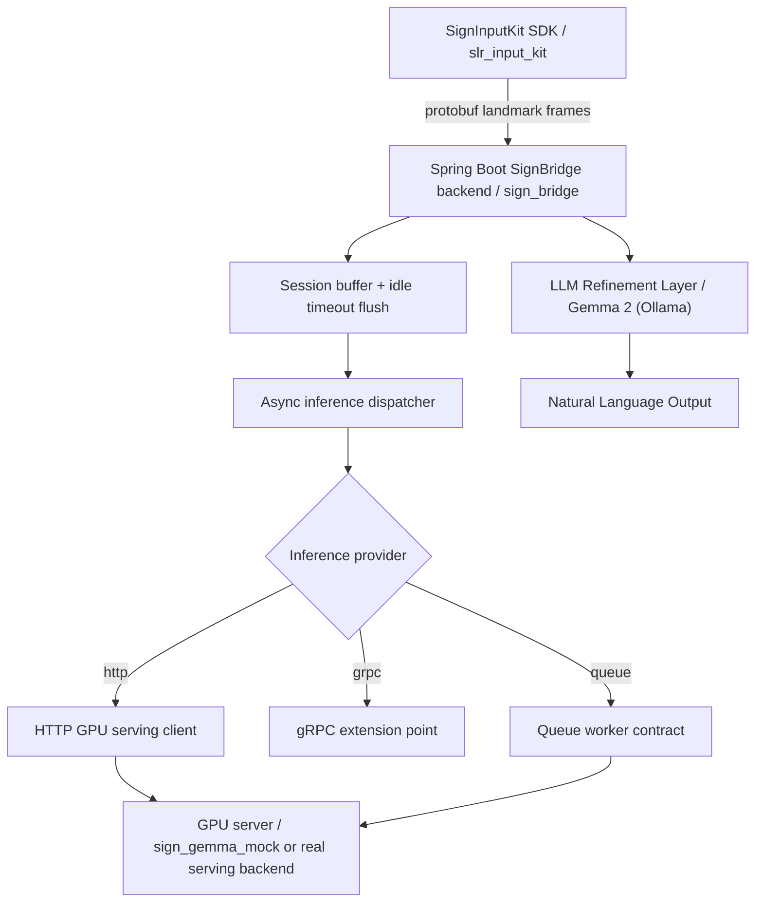

# SignBridge

This project is a cloud-oriented V2 prototype for sign language recognition.

- Platform/product branding: SignBridge platform powering the LinguaSign product
- SDK brand: SignInputKit, currently kept as package `slr_input_kit`
- Flutter client plugin: `sign/embedded/`
- Spring Boot bridge: `sign/backend/bridge/`
- Python mock GPU server: `sample/backend/model_server/`
- Shared protobuf schema: `sign/common/schema/`
- Promotional overview: [`PROJECT_PROMOTION_EN.md`](./docs/embedded/PROJECT_PROMOTION_EN.md) / [`PROJECT_PROMOTION_KO.md`](./docs/embedded/PROJECT_PROMOTION_KO.md)
- Korean social launch copy: [`SOCIAL_POSTS_KO.md`](./docs/backend/SOCIAL_POSTS_KO.md)
- Project architecture: [`PROJECT_ARCHITECTURE.md`](./docs/backend/PROJECT_ARCHITECTURE.md) / [`PROJECT_ARCHITECTURE_KO.md`](./docs/backend/PROJECT_ARCHITECTURE_KO.md)
- SignGemma app demo guide: [`SIGN_GEMMA_APP_DEMO.md`](./docs/backend/SIGN_GEMMA_APP_DEMO.md) / [`SIGN_GEMMA_APP_DEMO_KO.md`](./docs/backend/SIGN_GEMMA_APP_DEMO_KO.md)
- API / SPI reference: [`API_SPI_REFERENCE.md`](./docs/backend/API_SPI_REFERENCE.md)
- BE-model standard protocol: [`MODEL_PROTOCOL.md`](./docs/backend/MODEL_PROTOCOL.md)
- T2S / STS synthesis design: [`SIGN_SYNTHESIS_DESIGN.md`](./docs/backend/SIGN_SYNTHESIS_DESIGN.md) / [`SIGN_SYNTHESIS_DESIGN_KO.md`](./docs/backend/SIGN_SYNTHESIS_DESIGN_KO.md)
- Language model onboarding guide: [`LANGUAGE_MODEL_GUIDE.md`](./docs/backend/LANGUAGE_MODEL_GUIDE.md)
- SignGemma research notes: [`SIGN_GEMMA_RESEARCH.md`](./docs/embedded/SIGN_GEMMA_RESEARCH.md) / [`SIGN_GEMMA_RESEARCH_KO.md`](./docs/embedded/SIGN_GEMMA_RESEARCH_KO.md)

## Project Architecture

The shared runtime architecture and SignGemma-compatible demo flow are documented in [PROJECT_ARCHITECTURE.md](docs/backend/PROJECT_ARCHITECTURE.md). The Spring Boot + cross-platform app demo guide is [SIGN_GEMMA_APP_DEMO.md](docs/backend/SIGN_GEMMA_APP_DEMO.md). Korean versions are available in [PROJECT_ARCHITECTURE_KO.md](docs/backend/PROJECT_ARCHITECTURE_KO.md) and [SIGN_GEMMA_APP_DEMO_KO.md](docs/backend/SIGN_GEMMA_APP_DEMO_KO.md).

## Current Architecture


```mermaid
graph TD
    A["SignInputKit SDK / slr_input_kit"] -->|"protobuf landmark frames"| B["Spring Boot SignBridge backend / sign_bridge"]
    B --> C["Session buffer + idle timeout flush"]
    C --> D["Async inference dispatcher"]
    D --> E{"Inference provider"}
    E -->|"http"| F["HTTP GPU serving client"]
    E -->|"grpc"| G["gRPC extension point"]
    E -->|"queue"| H["Queue worker contract"]
    F --> I["GPU server / sign_gemma_mock or real serving backend"]
    H --> I
    B --> J["LLM Refinement Layer / Gemma 2 (Ollama)"]
    J --> K["Natural Language Output"]
```

## LLM-Powered Translation (V2 Extension)

The project now includes an LLM-based refinement layer that transforms raw sign language keywords (e.g., "I", "rice", "eat") into natural, grammatically correct sentences using **Gemma 2**.

- **Kotlin Migration**: The `sign_bridge` module has been modernized to Kotlin and uses `build.gradle.kts`.
- **Spring AI**: Integrated via the Spring AI Ollama starter for local LLM communication.
- **Prompt Engineering**: Includes specialized system prompts for sign-to-sentence translation and refinement.
- **REST API**: New endpoint `POST /api/v2/translate` for keyword refinement.

## Backend Features Implemented

- Protobuf landmark intake over `/ws/sign`
- Session-aware buffering and frame window aggregation
- Idle-timeout based automatic flush
- Async dispatch with per-session in-flight protection
- Provider routing for `http`, `grpc`, and `queue`
- HTTP serving contract through `GpuInferenceRequest` and `GpuInferenceResponse`
- Language-independent BE SPI through `InferenceContext` with standardized `locale`, `sign_language`, and `model_profile`
- Queue worker contract through `QueueInferenceTask`, `QueueInferenceResult`, `QueueInferenceTransport`, `QueueWorkerBackend`, and broker-style transport skeletons
- Operational endpoints
  - `GET /internal/healthz`
  - `GET /internal/readyz`
  - `GET /internal/metrics`
- T2S/STS phase 1 contract
  - `POST /api/v2/sign/synthesize`
  - `POST /api/v2/speech/sign`
  - mock `SignPlan + landmark motion` with Flutter/Web playback stubs
  - SPI boundaries for `SpeechToTextAdapter`, `SignPlanner`, `SignMotionGenerator`, and `SignSynthesisProvider`

## Provider Model

Inference transport is selected by `sign.gpu.provider`.

- `http`: active implementation via `HttpInferenceGateway`
- `grpc`: extension stub via `GrpcInferenceGateway`
- `queue`: queue-backed worker contract via `QueueInferenceGateway`

The queue provider now includes a second-level transport router:

- `in-memory`: executable local transport
- `kafka`: broker-style skeleton
- `rabbitmq`: broker-style skeleton

The contract remains executable today via the in-memory transport plus an HTTP-backed worker backend, while Kafka and RabbitMQ now have explicit transport extension points ready for real client libraries.

## Repository Structure

- `sign/embedded/`: embeddable SignInputKit SDK
- `sign/backend/`: remote recognition backend
- `sign/common/`: shared protobuf and evaluation contracts
- `sample/embedded/`: embedded SDK samples
- `sample/backend/`: model, web, and Docker backend samples
- `docs/embedded/`: embedded recognition documentation
- `docs/backend/`: streaming, API, and operations documentation

## Key Configuration

Main backend settings live in `sign/backend/bridge/src/main/resources/application.yml`.

- `sign.gpu.provider`
- `sign.gpu.base-url`
- `sign.gpu.infer-path`
- `sign.gpu.health-path`
- `sign.gpu.grpc-target`
- `sign.gpu.queue-topic`
- `sign.gpu.queue-transport`
- `sign.gpu.queue-request-topic`
- `sign.gpu.queue-result-topic`
- `sign.gpu.queue-consumer-group`
- `sign.gpu.queue-exchange`
- `sign.gpu.queue-routing-key`
- `sign.gpu.queue-timeout-ms`
- `sign.window.min-frames`
- `sign.window.idle-timeout-ms`
- `sign.async.core-pool-size`

## Local Development

1. Start the mock GPU server

```bash
cd sample/backend/model_server
python3 -m pip install -r requirements.txt
python3 main.py
```

2. Start the Spring bridge

```bash
cd sign/backend/bridge
./gradlew bootRun
```

3. Validate the Flutter package

```bash
dart analyze sign/embedded
```

4. Run the platform sample gallery

```bash
cd sample/embedded/flutter_app
flutter run
```

The sample app provides Android, iOS, iPad, Web, Windows, macOS/OSX, and Linux profiles. It uses `DemoLandmarkFrameSource` so the bridge and protobuf streaming flow can be exercised even before a real camera extractor is attached.

## Platform Samples

| Platform | Sample profile | Run command |
| --- | --- | --- |
| Android | `sample/embedded/flutter_app/lib/samples/android_sample.dart` | `flutter run -d android` |
| iOS | `sample/embedded/flutter_app/lib/samples/ios_sample.dart` | `flutter run -d ios` |
| iPad | `sample/embedded/flutter_app/lib/samples/ipad_sample.dart` | `flutter run -d <ipad-device-id>` |
| Web | `sample/embedded/flutter_app/lib/samples/web_sample.dart` | `flutter run -d chrome` |
| Windows | `sample/embedded/flutter_app/lib/samples/windows_sample.dart` | `flutter run -d windows` |
| macOS/OSX | `sample/embedded/flutter_app/lib/samples/macos_sample.dart` | `flutter run -d macos` |
| Linux | `sample/embedded/flutter_app/lib/samples/linux_sample.dart` | `flutter run -d linux` |

## Language and Sign Model Routing

The Flutter client appends `locale`, `sign_language`, `model_profile`, and `protocol_version` to the WebSocket URL based on the current platform locale. Active keyboard layout APIs differ by platform, so host apps that can read the actual keyboard/input language should pass an explicit `SignLanguageContext`.

English locales are normalized by the backend to `asl` and the `sign-gemma` model profile. The backend SPI stays language-independent by passing a standard `InferenceContext`, and model backends receive the JSON envelope documented in [`MODEL_PROTOCOL.md`](./docs/backend/MODEL_PROTOCOL.md).

Spring Boot exposes supported locale/sign-language/model routes at `GET /api/v2/model-profiles`. The Flutter sample's `Model profile` selector reads that endpoint and applies the selected profile to WebSocket, T2S, and STS requests, with bundled demo profiles as an offline fallback.

If a request explicitly provides an unknown `sign_language` or `model_profile`,
or combines registered values that do not belong to the same route, SignBridge
rejects it as an unsupported profile. REST synthesis APIs return HTTP 400, and
WebSocket clients receive an `unsupported-profile` event before close.

The API/SPI boundary is documented in [`API_SPI_REFERENCE.md`](./docs/backend/API_SPI_REFERENCE.md). New language model onboarding and the Sign Gemma-compatible model spec are documented in [`LANGUAGE_MODEL_GUIDE.md`](./docs/backend/LANGUAGE_MODEL_GUIDE.md).

Public SignGemma findings and landmark support notes are documented in [`SIGN_GEMMA_RESEARCH.md`](./docs/embedded/SIGN_GEMMA_RESEARCH.md).

## Local Broker Environments

### Kafka

Start Kafka:

```bash
docker compose -f sample/backend/docker-compose.kafka.yml up -d
```

Run the bridge with the Kafka profile:

```bash
cd sign/backend/bridge
./gradlew bootRun --args='--spring.profiles.active=kafka'
```

This profile enables:

- `sign.gpu.provider=queue`
- `sign.gpu.queue-transport=kafka`
- `sign.gpu.queue-broker-mode=spring`

### RabbitMQ

Start RabbitMQ:

```bash
docker compose -f sample/backend/docker-compose.rabbitmq.yml up -d
```

Run the bridge with the RabbitMQ profile:

```bash
cd sign/backend/bridge
./gradlew bootRun --args='--spring.profiles.active=rabbitmq'
```

This profile enables:

- `sign.gpu.provider=queue`
- `sign.gpu.queue-transport=rabbitmq`
- `sign.gpu.queue-broker-mode=spring`

### Shutdown

```bash
docker compose -f sample/backend/docker-compose.kafka.yml down
docker compose -f sample/backend/docker-compose.rabbitmq.yml down
```

## Integrated Local Stacks

Use the integrated Compose files when you want the broker, mock GPU, and Spring bridge together in one local stack:

```bash
docker compose -f sample/backend/docker-compose.stack.http.yml up -d --build
docker compose -f sample/backend/docker-compose.stack.kafka.yml up -d --build
docker compose -f sample/backend/docker-compose.stack.rabbitmq.yml up -d --build
```

The bridge containers in these stacks override broker host settings for Docker-internal networking, so the queue provider talks to `kafka:9092` or `rabbitmq:5672`, while the mock GPU remains available at `http://mock-gpu:8000`.

The HTTP provider stack can be verified end to end with one script. It builds
the stack, waits for readiness, checks profile discovery, calls T2S, and sends a
protobuf WebSocket probe:

```bash
./scripts/verify_docker_http_stack.sh
```

The mock GPU image is built from [`sample/backend/model_server/Dockerfile`](./sample/backend/model_server/Dockerfile) and pins Python dependencies through [`requirements.txt`](./sample/backend/model_server/requirements.txt), including the protobuf runtime required by the generated schema. For non-Docker local runs, use [`scripts/setup_mock_venv.sh`](./scripts/setup_mock_venv.sh) so the mock server runtime stays isolated in `sample/backend/model_server/.venv`.

The Flutter sample includes a `Bridge diagnostics` panel. It derives the HTTP
base URL from the active WebSocket URL and surfaces `/internal/healthz`,
`/internal/readyz`, `/api/v2/model-profiles`, `/swagger-ui.html`, and
`/v3/api-docs`. If the bridge is offline, the sample keeps bundled fallback
profiles and shows the failure reason in the panel.
The sample also enables automatic WebSocket reconnect with exponential backoff
for the `SignBridge Stream` widget.

## Regenerating Protobuf

After changing the shared schema, regenerate the Python mock module, Flutter
models, and Spring proto source from the same contract:

```bash
./scripts/regenerate_protobuf.sh
```

The script requires `protoc` and `protoc-gen-dart`. Spring Java protobuf output
is generated by Gradle during build; set `RUN_GRADLE=1` to run
`./gradlew generateProto` from the script as well.

To regenerate only the Python mock schema without the Dart plugin, run:

```bash
./scripts/regenerate_mock_protobuf.sh
```

## End-to-End Queue Validation

The repository now includes executable scripts that validate the real local queue worker path, including serializer or converter wiring, worker consumption, reply publication, and the WebSocket-to-queue-to-GPU round trip.

Kafka validation:

```bash
./scripts/verify_kafka_stack.sh
```

RabbitMQ validation:

```bash
./scripts/verify_rabbitmq_stack.sh
```

These scripts:

- start the integrated Docker stack
- wait for `/internal/healthz` and `/internal/readyz`
- send a binary protobuf WebSocket payload to `/ws/sign`
- verify that a final inference response is produced through the queue-backed worker flow
- assert that metrics show at least one completed inference

Set `KEEP_STACK=1` if you want the containers to stay up after the validation run.

## DLQ and Retry Samples

Broker-specific retry and dead-letter policy samples are available in:

- `sign/backend/bridge/src/main/resources/application-kafka-dlq.properties`
- `sign/backend/bridge/src/main/resources/application-rabbitmq-dlq.properties`

These sample files cover:

- retry topic or queue naming
- DLQ naming
- max attempts and backoff values
- listener defaults commonly paired with broker-side retry handling

They are sample baselines, not production-final settings.

## Verification

Backend verification:

```bash
cd sign/backend/bridge
./gradlew test
```

CI verification is defined in [ci.yml](./.github/workflows/ci.yml). It runs the
Spring Boot tests, Flutter package analysis, Flutter example tests, Python mock
import smoke, and eval fixtures.

## LLM Feature & Swagger Verification

### Translation API Test
Test the keyword refinement endpoint:

```bash
curl -X POST http://localhost:8080/api/v2/translate \
     -H "Content-Type: application/json" \
     -d '{"keywords": ["나", "밥", "먹다"]}'
```

### Swagger UI
Access the interactive API documentation at:
- **Swagger UI**: `http://localhost:8080/swagger-ui.html`
- **OpenAPI Docs**: `http://localhost:8080/v3/api-docs`

The OpenAPI contract includes example request and response payloads for model
profile discovery, T2S/STS synthesis, readiness, health, and metrics.
Prometheus text metrics are available at
`http://localhost:8080/internal/metrics.prometheus`.

To verify the Spring Boot bridge and mock model server without Docker, run:

```bash
./scripts/setup_mock_venv.sh
./scripts/verify_spring_openapi_smoke.sh
```

The smoke script automatically uses `sample/backend/model_server/.venv` when present and
exits early with a dependency hint when the selected Python protobuf runtime is
older than the generated mock schema.

Requires a local Ollama server running Gemma 2.

For full local integration coverage with real broker containers, run the queue validation scripts above.

## Current Status

This repository is no longer best described as a local FFI-only pipeline. The active implementation direction is a cloud bridge architecture with structured inference providers, async buffering, operational visibility, and a queue-ready worker contract.
