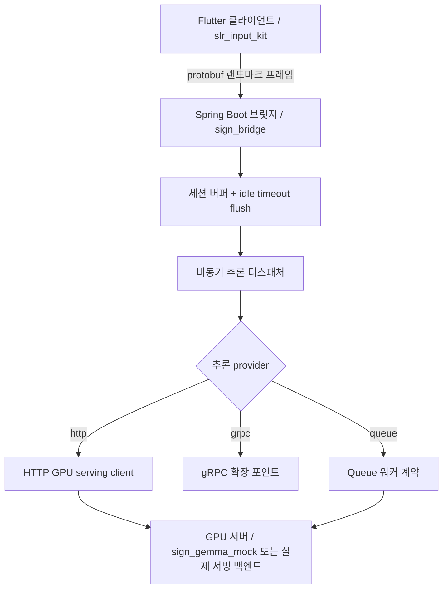

# MJ Sign

이 프로젝트는 수어 인식을 위한 클라우드 지향 V2 파이프라인 프로토타입입니다.

- Flutter 클라이언트 플러그인: `slr_input_kit/`
- Spring Boot 브릿지: `sign_bridge/`
- Python mock GPU 서버: `sign_gemma_mock/`
- 공용 protobuf 스키마: `schema/`

## 현재 아키텍처



## 현재 구현된 백엔드 기능

- `/ws/sign` WebSocket을 통한 protobuf landmark 수신
- 세션 단위 프레임 버퍼링과 window aggregation
- idle timeout 기반 자동 flush
- 세션별 in-flight 보호가 있는 비동기 추론 디스패치
- `http`, `grpc`, `queue` provider 라우팅
- `GpuInferenceRequest`, `GpuInferenceResponse` 기반 HTTP 서빙 계약
- `QueueInferenceTask`, `QueueInferenceResult`, `QueueInferenceTransport`, `QueueWorkerBackend`, broker 스타일 transport skeleton 기반 queue 워커 계약
- 운영용 endpoint
  - `GET /internal/healthz`
  - `GET /internal/readyz`
  - `GET /internal/metrics`

## Provider 구조

`sign.gpu.provider` 설정으로 추론 transport를 선택합니다.

- `http`: `HttpInferenceGateway`를 통한 활성 구현
- `grpc`: `GrpcInferenceGateway` 확장 스텁
- `queue`: `QueueInferenceGateway` 기반 queue 워커 계약

현재 queue provider 안에는 2차 transport 분기 구조가 있습니다.

- `in-memory`: 즉시 실행 가능한 로컬 transport
- `kafka`: broker 스타일 skeleton
- `rabbitmq`: broker 스타일 skeleton

현재는 in-memory transport와 HTTP 기반 워커 백엔드로 계약과 흐름을 검증할 수 있고, 이후 Kafka나 RabbitMQ 클라이언트를 해당 transport 클래스에 채우는 방식으로 확장할 수 있습니다.

## 디렉터리 구조

- `slr_input_kit/`
  Flutter 공개 API, 데모 위젯, protobuf 모델, Sign Bridge 클라이언트
- `sign_bridge/`
  Spring Boot WebSocket 브릿지, 버퍼링, async dispatch, provider routing, queue 워커 계약, 운영 endpoint
- `sign_gemma_mock/`
  현재 HTTP 추론 계약을 따르는 FastAPI mock 서빙 백엔드
- `schema/`
  Flutter, Java, Python이 공유하는 protobuf 스키마

## 주요 설정

주요 백엔드 설정은 `sign_bridge/src/main/resources/application.properties` 에 있습니다.

- `sign.gpu.provider`
- `sign.gpu.base-url`
- `sign.gpu.infer-path`
- `sign.gpu.health-path`
- `sign.gpu.grpc-target`
- `sign.gpu.queue-topic`
- `sign.gpu.queue-transport`
- `sign.gpu.queue-request-topic`
- `sign.gpu.queue-result-topic`
- `sign.gpu.queue-consumer-group`
- `sign.gpu.queue-exchange`
- `sign.gpu.queue-routing-key`
- `sign.gpu.queue-timeout-ms`
- `sign.window.min-frames`
- `sign.window.idle-timeout-ms`
- `sign.async.core-pool-size`

## 로컬 실행

1. mock GPU 서버 실행

```bash
cd sign_gemma_mock
python main.py
```

2. Spring 브릿지 실행

```bash
cd sign_bridge
./gradlew bootRun
```

3. Flutter 패키지 검증

```bash
dart analyze slr_input_kit
```

## 로컬 브로커 실행 환경

### Kafka

Kafka 실행:

```bash
docker compose -f docker-compose.kafka.yml up -d
```

Kafka 프로필로 브릿지 실행:

```bash
cd sign_bridge
./gradlew bootRun --args='--spring.profiles.active=kafka'
```

이 프로필은 다음을 활성화합니다.

- `sign.gpu.provider=queue`
- `sign.gpu.queue-transport=kafka`
- `sign.gpu.queue-broker-mode=spring`

### RabbitMQ

RabbitMQ 실행:

```bash
docker compose -f docker-compose.rabbitmq.yml up -d
```

RabbitMQ 프로필로 브릿지 실행:

```bash
cd sign_bridge
./gradlew bootRun --args='--spring.profiles.active=rabbitmq'
```

이 프로필은 다음을 활성화합니다.

- `sign.gpu.provider=queue`
- `sign.gpu.queue-transport=rabbitmq`
- `sign.gpu.queue-broker-mode=spring`

### 종료

```bash
docker compose -f docker-compose.kafka.yml down
docker compose -f docker-compose.rabbitmq.yml down
```

## 통합 로컬 스택

브로커, mock GPU, Spring 브릿지를 한 번에 올리려면 아래 compose 파일을 사용하면 됩니다.

```bash
docker compose -f docker-compose.stack.kafka.yml up -d
docker compose -f docker-compose.stack.rabbitmq.yml up -d
```

통합 스택의 브릿지 컨테이너는 Docker 내부 네트워크 기준으로 Kafka는 `kafka:9092`, RabbitMQ는 `rabbitmq:5672` 를 바라보도록 오버라이드되어 있고, mock GPU는 `http://mock-gpu:8000` 으로 연결됩니다.

## Queue 실제 통합 검증

이제 저장소에는 serializer/converter 설정과 worker 소비-결과 생산 흐름을 실제 로컬 브로커 위에서 검증하는 스크립트가 포함되어 있습니다.

Kafka 검증:

```bash
./scripts/verify_kafka_stack.sh
```

RabbitMQ 검증:

```bash
./scripts/verify_rabbitmq_stack.sh
```

이 스크립트가 수행하는 일:

- 통합 Docker 스택 기동
- `/internal/healthz`, `/internal/readyz` 대기
- `/ws/sign` 으로 protobuf binary WebSocket payload 전송
- queue 기반 worker 흐름을 거쳐 최종 inference 응답이 돌아오는지 확인
- metrics 에서 완료된 inference 수가 증가했는지 확인

검증 후 스택을 유지하려면 `KEEP_STACK=1` 로 실행하면 됩니다.

## DLQ 및 재시도 샘플

브로커별 retry / dead-letter 정책 샘플은 아래 파일에 정리되어 있습니다.

- `sign_bridge/src/main/resources/application-kafka-dlq.properties`
- `sign_bridge/src/main/resources/application-rabbitmq-dlq.properties`

샘플에 포함된 내용:

- retry topic 또는 queue 네이밍
- DLQ 네이밍
- 최대 재시도 횟수와 backoff 값
- 브로커 재시도 정책과 함께 자주 쓰는 listener 기본값

이 값들은 운영 확정값이 아니라, 환경별 튜닝을 위한 기준 샘플입니다.

## 검증

백엔드 검증:

```bash
cd sign_bridge
./gradlew test
```

실제 로컬 브로커까지 포함한 end-to-end 검증은 위 queue 검증 스크립트를 사용하면 됩니다.

## 현재 상태 요약

이 저장소는 더 이상 로컬 FFI 전용 파이프라인으로 보기 어렵습니다. 현재 구현의 중심은 클라우드 브릿지 아키텍처이며, 구조화된 inference provider, 비동기 버퍼링, 운영 가시성, queue-ready 워커 계약까지 포함하는 방향으로 정리되어 있습니다.
