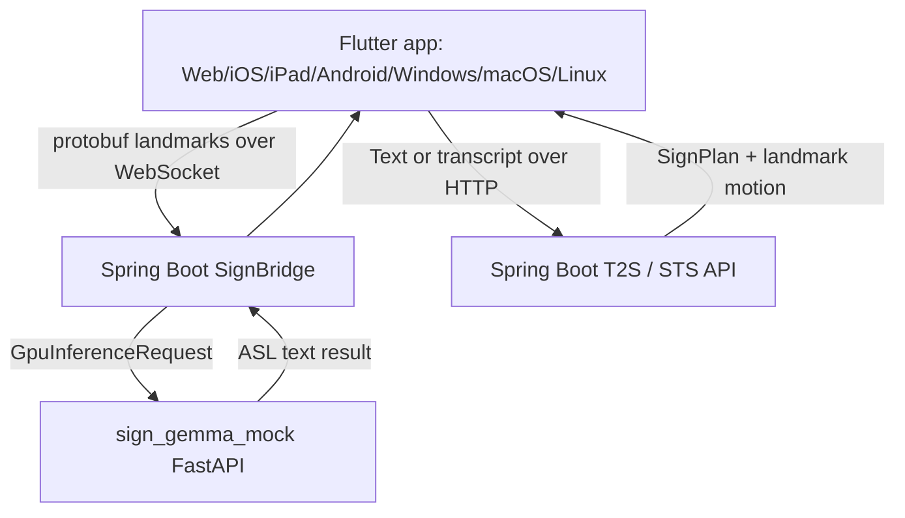

# SignGemma Spring Boot + Cross-Platform App Demo

This guide explains the runnable demo that connects a Spring Boot SignBridge
application to Web, iOS, iPad, Android, Windows, macOS, and Linux Flutter
samples. Because official SignGemma checkpoints and input specs are not publicly
verified yet, the demo treats `model_profile=sign-gemma` as a
SignGemma-compatible ASL serving profile.

Korean version: [SIGN_GEMMA_APP_DEMO_KO.md](./SIGN_GEMMA_APP_DEMO_KO.md)

## Architecture Reference

The shared runtime architecture and SignGemma-compatible flow are documented in
[PROJECT_ARCHITECTURE.md](./PROJECT_ARCHITECTURE.md). The Korean architecture
reference is [PROJECT_ARCHITECTURE_KO.md](./PROJECT_ARCHITECTURE_KO.md).

## Demo Topology



## Demo Goals

- Let the Spring Boot application receive and route `model_profile=sign-gemma`.
- Let every Flutter platform sample use the same API contract.
- Validate S2T through WebSocket protobuf landmark streaming.
- Validate T2S and STS through Spring Boot HTTP endpoints and mock
  `SignPlan + landmark motion` playback.
- Keep the adapter boundary stable so an official SignGemma-compatible serving
  backend can replace `sign_gemma_mock` later.

## Run The Demo

1. Start the SignGemma-compatible mock server.

```bash
cd sign_gemma_mock
python3 -m uvicorn main:app --host 127.0.0.1 --port 8001
```

2. Start the Spring Boot bridge.

```bash
cd sign_bridge
./gradlew bootRun --args='--spring.profiles.active=signgemma-demo --sign.gpu.base-url=http://127.0.0.1:8001'
```

3. Start a Flutter sample.

```bash
cd slr_input_kit/example
flutter run -d chrome
```

To run the browser sample through the web-server device:

```bash
cd slr_input_kit/example
flutter run -d web-server --web-hostname 127.0.0.1 --web-port 8090
```

Then open `http://127.0.0.1:8090`.

## Platform Commands

| Target | Command |
| --- | --- |
| Web | `flutter run -d chrome` |
| Android | `flutter run -d android` |
| iOS | `flutter run -d ios` |
| iPad | `flutter run -d <ipad-device-id>` |
| Windows | `flutter run -d windows` |
| macOS / OSX | `flutter run -d macos` |
| Linux | `flutter run -d linux` |

## App Walkthrough

1. Select a target in `Choose a platform sample`.
2. Check the `Bridge connection` WebSocket URL.
   - Android emulator: `ws://10.0.2.2:8080/ws/sign`
   - Web, desktop, and iOS simulator on the same machine:
     `ws://127.0.0.1:8080/ws/sign`
   - Physical devices: use the host machine LAN IP.
3. The `SlrInputWidget` sends demo landmark frames to Spring Boot `/ws/sign`.
4. Mock SignGemma-compatible S2T results appear in `Recognized text`.
5. Enter a sentence or speech transcript in `SignGemma T2S / STS`.
6. Press `Text to Sign` or `Speech to Sign`.
7. `SignOutputWidget` plays the returned landmark motion.

## API Checks

Spring Boot readiness:

```bash
curl -fsS http://127.0.0.1:8080/internal/readyz
```

Text-to-Sign:

```bash
curl -fsS \
  -H 'Content-Type: application/json' \
  -d '{"session_id":"demo-t2s","text":"I need help tomorrow.","locale":"en-US","sign_language":"asl","model_profile":"sign-gemma"}' \
  http://127.0.0.1:8080/api/v2/sign/synthesize
```

Speech-to-Sign transcript:

```bash
curl -fsS \
  -H 'Content-Type: application/json' \
  -d '{"session_id":"demo-sts","transcript":"I need help tomorrow.","locale":"en-US","sign_language":"asl","model_profile":"sign-gemma"}' \
  http://127.0.0.1:8080/api/v2/speech/sign
```

## Current Limits

- The demo does not load official SignGemma weights.
- `sign_gemma_mock` is a contract-validation backend for the ASL/English
  `sign-gemma` profile until an official model card and artifact are available.
- The production camera landmark extractor remains an explicit replacement
  point for the current `DemoLandmarkFrameSource`.

## Troubleshooting

| Symptom | Check |
| --- | --- |
| Spring Boot readiness is `DOWN` | Confirm the mock server port and `sign.gpu.base-url` match |
| Android emulator cannot connect | Use `10.0.2.2` instead of `127.0.0.1` |
| Physical phone/tablet cannot connect | Check host LAN IP, same Wi-Fi, and firewall rules |
| Browser camera permission fails | Use localhost or an HTTPS secure origin |
| T2S/STS preview is empty | Check `motion.frames` in the Spring Boot synthesis response |
