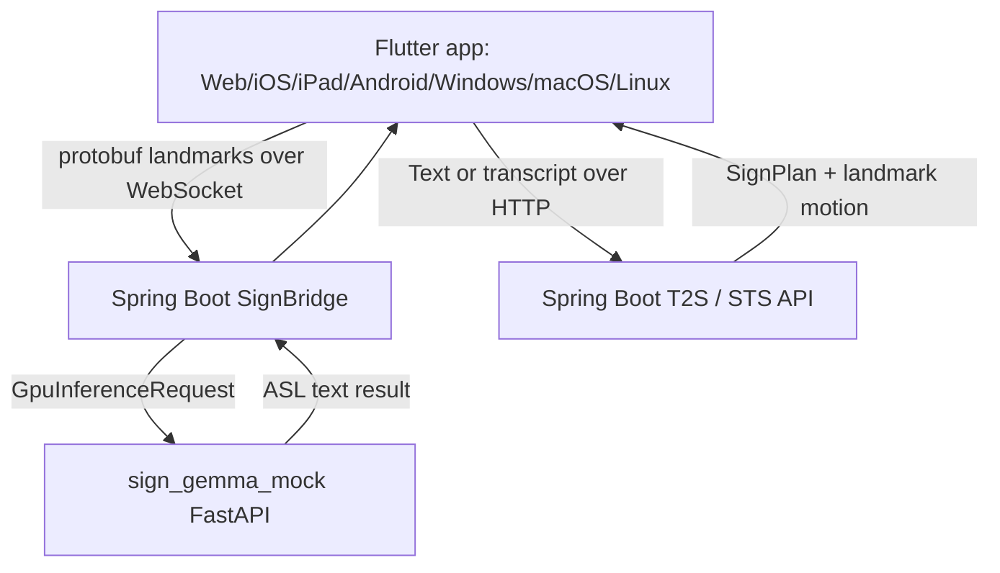

# SignGemma Spring Boot + Cross-Platform App Demo

이 문서는 현재 공개적으로 확인 가능한 SignGemma 상태를 기준으로 실행 가능한
예제 구성을 설명합니다. 공식 SignGemma checkpoint와 입력 spec이 아직 확인되지
않았기 때문에, 여기서는 `sign-gemma` profile을 SignGemma-compatible ASL
계약으로 사용합니다.

## Project Architecture / 프로젝트 아키텍처

공통 런타임 구조와 SignGemma-compatible 예제 흐름은 [PROJECT_ARCHITECTURE_KO.md](PROJECT_ARCHITECTURE_KO.md)에 정리되어 있습니다. Spring Boot + cross-platform app 실행 가이드는 [SIGN_GEMMA_APP_DEMO_KO.md](SIGN_GEMMA_APP_DEMO_KO.md)를 참고하세요.

## 구성



## 예제 목표

- Spring Boot application이 `model_profile=sign-gemma` 요청을 받을 수 있게 합니다.
- Web/iOS/iPad/Android/Windows/macOS/Linux Flutter sample이 같은 API 계약을
  사용하게 합니다.
- S2T(Sign-to-Text)는 WebSocket protobuf landmark stream으로 검증합니다.
- T2S(Text-to-Sign)와 STS(Speech-to-Sign)는 Spring Boot HTTP endpoint와
  mock `SignPlan + landmark motion` playback으로 검증합니다.
- 이후 공식 SignGemma artifact가 공개되면 `sign_gemma_mock` 또는 외부 model
  serving adapter만 교체합니다.

## 실행 순서

1. SignGemma-compatible mock 서버 실행

```bash
cd sign_gemma_mock
python3 -m uvicorn main:app --host 127.0.0.1 --port 8001
```

2. Spring Boot bridge 실행

```bash
cd sign_bridge
./gradlew bootRun --args='--spring.profiles.active=signgemma-demo --sign.gpu.base-url=http://127.0.0.1:8001'
```

3. Flutter cross-platform sample 실행

```bash
cd slr_input_kit/example
flutter run -d chrome
```

Web server 방식으로 실행하려면:

```bash
cd slr_input_kit/example
flutter run -d web-server --web-hostname 127.0.0.1 --web-port 8090
```

이 경우 브라우저에서 `http://127.0.0.1:8090`을 엽니다.

플랫폼별 실행 명령:

| 대상 | 명령 |
| --- | --- |
| Web | `flutter run -d chrome` |
| Android | `flutter run -d android` |
| iOS | `flutter run -d ios` |
| iPad | `flutter run -d <ipad-device-id>` |
| Windows | `flutter run -d windows` |
| macOS / OSX | `flutter run -d macos` |
| Linux | `flutter run -d linux` |

## 화면 사용법

1. `Choose a platform sample`에서 대상 플랫폼을 선택합니다.
2. `Bridge connection`의 WebSocket URL을 확인합니다.
   - Android emulator: `ws://10.0.2.2:8080/ws/sign`
   - 같은 머신의 Web/desktop/iOS simulator: `ws://127.0.0.1:8080/ws/sign`
   - 실제 기기: host machine의 LAN IP를 사용합니다.
3. 위쪽 `SlrInputWidget`은 demo landmark source를 Spring Boot `/ws/sign`으로
   보냅니다.
4. `Recognized text`에 mock SignGemma-compatible S2T 결과가 표시됩니다.
5. `SignGemma T2S / STS` 패널에 문장 또는 speech transcript를 입력합니다.
6. `Text to Sign` 또는 `Speech to Sign`을 누르면 Spring Boot synthesis API가
   호출되고, `SignOutputWidget`이 반환된 landmark motion을 재생합니다.

## API 확인

Spring Boot readiness:

```bash
curl -fsS http://127.0.0.1:8080/internal/readyz
```

Text-to-Sign:

```bash
curl -fsS \
  -H 'Content-Type: application/json' \
  -d '{"session_id":"demo-t2s","text":"I need help tomorrow.","locale":"en-US","sign_language":"asl","model_profile":"sign-gemma"}' \
  http://127.0.0.1:8080/api/v2/sign/synthesize
```

Speech-to-Sign transcript:

```bash
curl -fsS \
  -H 'Content-Type: application/json' \
  -d '{"session_id":"demo-sts","transcript":"I need help tomorrow.","locale":"en-US","sign_language":"asl","model_profile":"sign-gemma"}' \
  http://127.0.0.1:8080/api/v2/speech/sign
```

## 앱에서 확인할 수 있는 것

- S2T: demo landmark stream이 Spring Boot `/ws/sign`으로 전송되고,
  Spring Boot가 `model_profile=sign-gemma` 요청을 `sign_gemma_mock`으로
  전달합니다.
- T2S: 앱의 `Text to Sign` 버튼이 Spring Boot
  `POST /api/v2/sign/synthesize`를 호출합니다.
- STS: 앱의 `Speech to Sign` 버튼이 실제 audio 대신 speech transcript를
  Spring Boot `POST /api/v2/speech/sign`으로 전달합니다.
- Playback: Spring Boot가 반환한 `SignPlan + landmark motion`을
  `SignOutputWidget`이 재생합니다.

## 현재 한계

- 이 예제는 공식 SignGemma weight를 로딩하지 않습니다.
- `sign_gemma_mock`은 공식 SignGemma model card가 나오기 전까지
  ASL/English `sign-gemma` profile의 serving contract를 검증하기 위한
  mock backend입니다.
- 실제 카메라 기반 landmark extractor는 production checklist에 남겨 둔
  교체 지점입니다.

## 문제 해결

| 증상 | 확인할 것 |
| --- | --- |
| Spring Boot readiness가 `DOWN` | `sign_gemma_mock` 서버 port와 `sign.gpu.base-url`이 같은지 확인 |
| Android emulator가 bridge에 연결 안 됨 | `127.0.0.1` 대신 `10.0.2.2` 사용 |
| 실제 iPhone/iPad/Android 기기가 연결 안 됨 | 같은 Wi-Fi의 host LAN IP와 방화벽 확인 |
| Web에서 카메라 권한 실패 | localhost 또는 HTTPS secure origin에서 실행 |
| T2S/STS preview가 비어 있음 | Spring Boot `/api/v2/sign/synthesize` 응답의 `motion.frames` 확인 |
