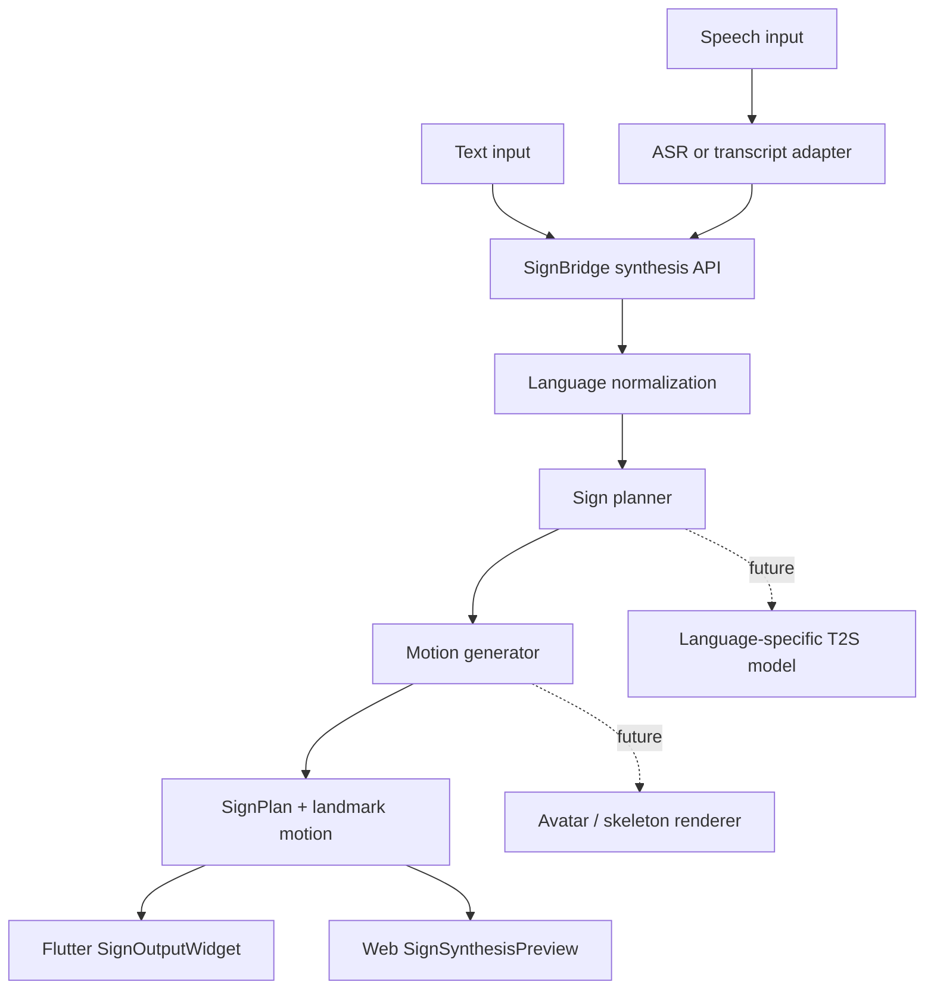

# SignBridge T2S / STS Design

This document defines how LinguaSign turns text or speech into sign-language motion. To avoid confusion with the common Text-to-Speech meaning of `TTS`, this project uses `T2S(Text-to-Sign)` for text input and `STS(Speech-to-Sign)` for speech input.

## Goals

- Add T2S/STS without coupling it to the existing S2T(Sign-to-Text) recognition path.
- Keep the backend API/SPI identical across spoken and sign languages.
- Route language-specific behavior through `locale`, `sign_language`, `model_profile`, and planner/model profiles.
- In the first phase, return a mock `SignPlan + landmark motion` instead of running a real generation model, so clients can validate playback, API contracts, and operational flow now.
- Keep boundaries stable enough to replace the mock layer with ASR, SignGemma-compatible generation, and 3D avatar rendering later.

## Scope

Phase 1 implementation:

- `POST /api/v2/sign/synthesize`: converts text into a sign plan and landmark motion.
- `POST /api/v2/speech/sign`: converts a speech transcript or mock audio placeholder into a sign plan and landmark motion.
- Defines the `signbridge-synthesis-v1` JSON envelope.
- Adds Flutter `SignOutputWidget` for landmark motion playback.
- Adds Web `SignSynthesisHttpClient` and `SignSynthesisPreview` for HTTP calls and preview playback.

Out of scope for phase 1:

- Running a real ASR model
- Running a real Text-to-Sign generation model
- 3D skeleton, mesh, or avatar retargeting
- Validating production-quality language-specific sign grammar
- Deaf reviewer evaluation

## Flow



## Public API

### Text-to-Sign

```text
POST /api/v2/sign/synthesize
```

Request:

```json
{
  "session_id": "t2s-ko-demo",
  "source_type": "text",
  "text": "내일 병원에 가야 합니다.",
  "locale": "ko-KR",
  "sign_language": "ksl",
  "model_profile": "sign-gemma-ko",
  "output_format": "landmarks",
  "protocol_version": "signbridge-synthesis-v1"
}
```

### Speech-to-Sign

```text
POST /api/v2/speech/sign
```

Request:

```json
{
  "session_id": "sts-en-demo",
  "source_type": "speech",
  "transcript": "I need help tomorrow.",
  "audio_b64": null,
  "locale": "en-US",
  "sign_language": "asl",
  "model_profile": "sign-gemma",
  "output_format": "landmarks",
  "protocol_version": "signbridge-synthesis-v1"
}
```

The phase 1 implementation prefers `transcript`. If only `audio_b64` is provided, SignBridge uses a mock speech input until an ASR adapter is attached.

## Response Envelope

```json
{
  "session_id": "t2s-ko-demo",
  "event_type": "synthesis_result",
  "source_type": "text",
  "text": "내일 병원에 가야 합니다.",
  "locale": "ko-KR",
  "sign_language": "ksl",
  "model_profile": "sign-gemma-ko",
  "protocol_version": "signbridge-synthesis-v1",
  "sign_plan": {
    "glosses": ["내일", "병원", "가다"],
    "non_manual_markers": ["neutral"],
    "grammar_note": "Mock KSL-compatible gloss order. Replace with a language-specific planner before production."
  },
  "motion": {
    "format": "landmark-frames",
    "fps": 12,
    "frame_count": 24,
    "frames": []
  },
  "is_final": true,
  "confidence": 0.82,
  "error": null
}
```

`motion.frames` is an array of landmark frames with `timestamp_ms`, `left_hand`, `right_hand`, `pose`, and `face_contour`. Each point uses the same `x`, `y`, `z` shape as the current protobuf `Point3D`.

## Backend SPI

The phase 1 implementation keeps the mock planner and mock motion generator inside `SignSynthesisService`. In production, split the flow behind these extension points:

```java
SignSynthesisResult synthesize(SignSynthesisRequest request)
```

Recommended extension points:

- `SpeechToTextAdapter`: converts audio into transcript text.
- `SignPlanner`: converts text/transcript into language-specific glosses, NMS, and timing plans.
- `SignMotionGenerator`: converts the plan into landmark frames, skeleton frames, or avatar motion.
- `SignSynthesisProvider`: abstracts local/mock/http/grpc/queue transports.

## Language And Model Routing

T2S/STS uses the same language onboarding principle as S2T.

- Korean/KSL default: `locale=ko-KR`, `sign_language=ksl`, `model_profile=sign-gemma-ko`
- English/ASL default: `locale=en-US`, `sign_language=asl`, `model_profile=sign-gemma`
- New languages should add mappings and model profiles without changing the BE API.
- When an official SignGemma schema is available, replace the current `sign-gemma-compatible` mock profile with an official adapter.

## Client Playback

Flutter:

- `SignSynthesisResult.fromJson` converts backend JSON into `LandmarkFrame` values.
- `SignOutputWidget` displays landmark playback from a frame list or frame stream.

Web:

- `SignSynthesisHttpClient` calls the T2S/STS endpoints.
- `SignSynthesisPreview` replays `motion.frames` as an SVG landmark preview.

## Failure Handling

- Return `400 Bad Request` when both `text` and `transcript` are missing.
- Keep the envelope shape stable and report model-side failures through `error`.
- Clients should convert `error != null` or HTTP non-2xx responses into user-facing messages.
- If the frame count is zero, playback widgets remain in placeholder mode.

## Development Priority

1. Freeze the API contract and playback stubs. This is the current phase 1 implementation.
2. Add an ASR adapter for `audio_b64` or multipart audio.
3. Extract the language-specific `SignPlanner` SPI and test KSL/ASL mock planners.
4. Connect real T2S model providers behind `http/grpc/queue` transports.
5. Retarget landmark motion into 3D skeleton/avatar motion.
6. Add Deaf reviewer evaluation sets and quality metrics.
