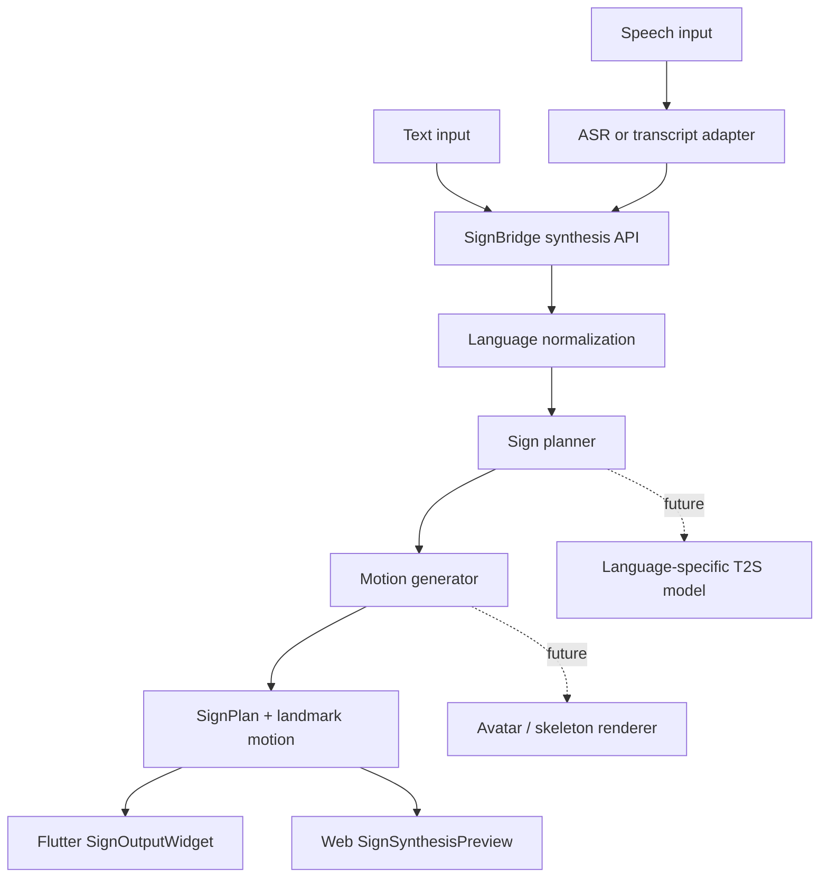

# SignBridge T2S / STS 설계

이 문서는 LinguaSign에서 텍스트나 음성을 수어 motion으로 변환하는 기능을 정의합니다. 혼동을 줄이기 위해 일반적인 Text-to-Speech 의미의 `TTS` 대신 `T2S(Text-to-Sign)`를 기준 용어로 사용하고, 음성 입력은 `STS(Speech-to-Sign)`로 표준화합니다.

## 목표

- 기존 S2T(Sign-to-Text) 인식 경로와 독립적으로 T2S/STS를 추가합니다.
- BE API/SPI는 언어와 관계없이 동일하게 유지합니다.
- 언어별 차이는 `locale`, `sign_language`, `model_profile`, planner/model profile에서 처리합니다.
- 첫 단계에서는 실제 생성 모델 대신 mock `SignPlan + landmark motion`을 반환해 client playback, API 계약, 운영 흐름을 먼저 검증합니다.
- 이후 실제 ASR, SignGemma-compatible 생성 모델, 3D avatar renderer로 교체할 수 있게 경계를 고정합니다.

## 범위

현재 구현하는 1차 범위:

- `POST /api/v2/sign/synthesize`: text를 수어 계획과 landmark motion으로 변환합니다.
- `POST /api/v2/speech/sign`: speech transcript 또는 mock audio placeholder를 수어 계획과 landmark motion으로 변환합니다.
- `signbridge-synthesis-v1` JSON envelope를 정의합니다.
- Flutter `SignOutputWidget`으로 landmark motion playback stub을 제공합니다.
- Web `SignSynthesisHttpClient`와 `SignSynthesisPreview`로 HTTP 호출 및 preview stub을 제공합니다.

아직 1차 범위가 아닌 것:

- 실제 음성 ASR 모델 실행
- 실제 Text-to-Sign 생성 모델 추론
- 3D skeleton/mesh/avatar retargeting
- 언어별 문법 planner의 완성도 검증
- Deaf reviewer 기반 품질 평가

## 전체 흐름



## Public API

### Text-to-Sign

```text
POST /api/v2/sign/synthesize
```

Request:

```json
{
  "session_id": "t2s-ko-demo",
  "source_type": "text",
  "text": "내일 병원에 가야 합니다.",
  "locale": "ko-KR",
  "sign_language": "ksl",
  "model_profile": "sign-gemma-ko",
  "output_format": "landmarks",
  "protocol_version": "signbridge-synthesis-v1"
}
```

### Speech-to-Sign

```text
POST /api/v2/speech/sign
```

Request:

```json
{
  "session_id": "sts-en-demo",
  "source_type": "speech",
  "transcript": "I need help tomorrow.",
  "audio_b64": null,
  "locale": "en-US",
  "sign_language": "asl",
  "model_profile": "sign-gemma",
  "output_format": "landmarks",
  "protocol_version": "signbridge-synthesis-v1"
}
```

1차 구현에서는 `transcript`를 우선 사용합니다. `audio_b64`만 들어온 경우는 실제 ASR 연결 전까지 mock speech input으로 처리합니다.

## Response Envelope

```json
{
  "session_id": "t2s-ko-demo",
  "event_type": "synthesis_result",
  "source_type": "text",
  "text": "내일 병원에 가야 합니다.",
  "locale": "ko-KR",
  "sign_language": "ksl",
  "model_profile": "sign-gemma-ko",
  "protocol_version": "signbridge-synthesis-v1",
  "sign_plan": {
    "glosses": ["내일", "병원", "가다"],
    "non_manual_markers": ["neutral"],
    "grammar_note": "Mock KSL-compatible gloss order. Replace with a language-specific planner before production."
  },
  "motion": {
    "format": "landmark-frames",
    "fps": 12,
    "frame_count": 24,
    "frames": []
  },
  "is_final": true,
  "confidence": 0.82,
  "error": null
}
```

`motion.frames`는 `timestamp_ms`, `left_hand`, `right_hand`, `pose`, `face_contour`를 가진 landmark frame 배열입니다. 점 좌표는 현재 protobuf `Point3D`와 같은 `x`, `y`, `z`를 사용합니다.

## Backend SPI

현재 1차 구현은 `SignSynthesisService`가 mock planner와 mock motion generator를 직접 포함합니다. 운영 단계에서는 아래처럼 분리합니다.

```java
SignSynthesisResult synthesize(SignSynthesisRequest request)
```

권장 확장 포인트:

- `SpeechToTextAdapter`: audio를 transcript로 변환합니다.
- `SignPlanner`: text/transcript를 언어별 gloss, NMS, timing plan으로 변환합니다.
- `SignMotionGenerator`: plan을 landmark frames, skeleton frames, avatar motion으로 변환합니다.
- `SignSynthesisProvider`: local/mock/http/grpc/queue transport를 추상화합니다.

## 언어/모델 라우팅

언어별 모델 추가 원칙은 S2T와 동일합니다.

- Korean/KSL 기본값: `locale=ko-KR`, `sign_language=ksl`, `model_profile=sign-gemma-ko`
- English/ASL 기본값: `locale=en-US`, `sign_language=asl`, `model_profile=sign-gemma`
- 새 언어는 BE API를 바꾸지 않고 mapping과 model profile만 추가합니다.
- 실제 SignGemma 공식 schema가 공개되면 `sign-gemma-compatible` mock profile을 공식 adapter로 교체합니다.

## Client Playback

Flutter:

- `SignSynthesisResult.fromJson`으로 backend JSON을 `LandmarkFrame` 목록으로 변환합니다.
- `SignOutputWidget`이 frame list 또는 frame stream을 받아 landmark playback을 표시합니다.

Web:

- `SignSynthesisHttpClient`가 T2S/STS endpoint를 호출합니다.
- `SignSynthesisPreview`가 `motion.frames`를 SVG landmark preview로 재생합니다.

## 실패 처리

- `text`와 `transcript`가 모두 없으면 `400 Bad Request`를 반환합니다.
- 모델 단계 오류는 envelope shape을 바꾸지 않고 `error`에 기록합니다.
- client는 `error != null` 또는 HTTP non-2xx를 사용자 메시지로 변환합니다.
- frame 수가 0이면 playback widget은 placeholder 상태를 유지합니다.

## 개발 우선순위

1. API 계약과 playback stub을 고정합니다. 현재 완료된 1차 구현입니다.
2. ASR adapter를 붙여 `audio_b64` 또는 multipart audio를 transcript로 변환합니다.
3. 언어별 `SignPlanner` SPI를 분리하고 KSL/ASL mock planner를 테스트합니다.
4. 실제 T2S model provider를 `http/grpc/queue` transport 뒤에 연결합니다.
5. landmark motion을 3D skeleton/avatar motion으로 retargeting합니다.
6. Deaf reviewer evaluation set과 품질 지표를 추가합니다.
