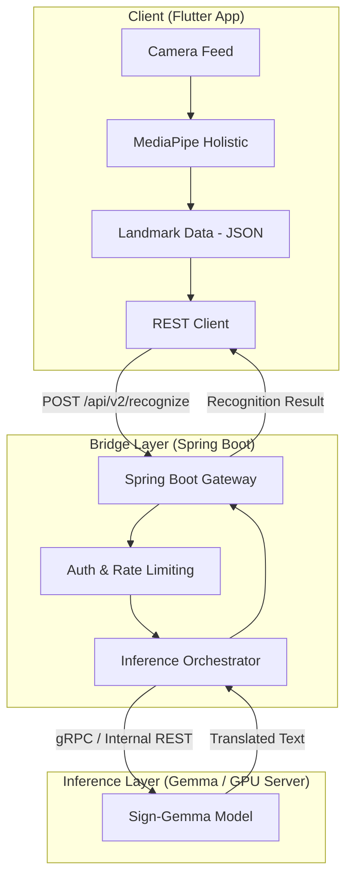

# Architecture V2: Cloud-based Sign Language AI (Sign-Gemma & Spring Boot)

This document outlines the transition from a local FFI-based architecture to a cloud-based inference system using Google's Sign-Gemma and a Spring Boot REST API.

## 1. Overview
The new architecture shifts the heavy lifting (Inference) from the user's device to a powerful GPU-backed server. This allows us to use large-scale multimodal models like **Sign-Gemma** (part of the Gemma 3/PaliGemma family) which offers significantly higher translation accuracy than lightweight TFLite models.

## 2. Proposed System Architecture

## 3. Comparison of Architectures

| Feature | Architecture V1 (FFI/Local) | Architecture V2 (Spring/Cloud) |
| :--- | :--- | :--- |
| **Model** | SignFormer-GCN (TFLite) | **Sign-Gemma** (Gemma 3 / Multimodal) |
| **Processor** | Mobile CPU/NPU | **Cloud GPU (T4/L4/H100)** |
| **Memory** | < 500MB | **2GB - 8GB+** |
| **Latency** | < 50ms | **200ms - 800ms** (due to network) |
| **Connectivity** | Offline supported | **Online Required** |
| **Accuracy** | High (Pattern-based) | **Superior** (Semantic understanding) |

## 4. Feasibility Analysis

### 4.1. Sign-Gemma (Native Inference)
- **Feasibility:** **High**. Gemma 3 multimodal models can process visual landmarks directly or image frames.
- **Optimization:** To reduce latency, we recommend sending **Hand Landmarks (extracted locally via MediaPipe)** instead of raw video frames. This reduces payload size from MBs to KBs.

### 4.2. Spring Boot Bridge
- **Feasibility:** **Extremely High**.
- **Implementation:** Spring Boot acts as the "Bridge" providing:
  - **API Standardization:** Exposing a clean REST/WebSocket interface.
  - **Asynchronous Processing:** Handling long-running model inference without blocking threads.
  - **Security:** Managing API keys and user context.

## 5. Technical Challenges & Solutions
1. **Bandwidth:** Sending high-res video kills the experience. 
   - *Solution:* Extract landmarks on the Flutter client and send only the 543 coordinate points per frame.
2. **Real-time feel:** REST might be too slow for "real-time" streaming.
   - *Solution:* Use **WebSockets (STOMP)** in Spring Boot for a continuous bi-directional stream of landmarks and results.

## 6. Implementation Strategy
1. **Containerization:** Deploy the Sign-Gemma model using **Ollama** or **vLLM** for easy scaling.
2. **Spring Integration:** Use **Spring AI** (Experimental) or `WebClient` to proxy requests to the model server.
3. **Flutter Client:** Update `slr_input_kit` to switch from its FFI implementation to a Network implementation.
