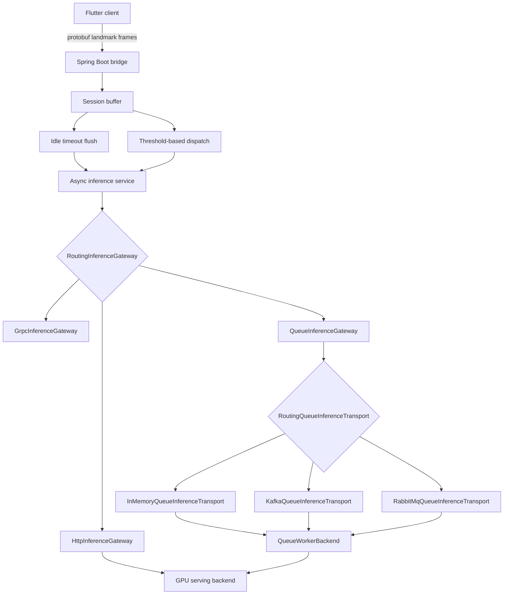

# Architecture V2: Cloud Sign Recognition Bridge

This document reflects the current V2 implementation direction in this repository. The project has moved from a purely local FFI concept toward a cloud bridge model with async buffering, provider routing, queue-worker contracts, and operational visibility.

## 1. Current System Shape

## 2. What Is Already Implemented

### 2.1 Spring Bridge
- Binary protobuf ingestion over WebSocket
- Session-aware frame buffering
- Idle timeout based flush
- Async inference dispatch with per-session in-flight control
- Operational endpoints for health, readiness, and metrics

### 2.2 Inference Providers
- `http`
  Active path using `HttpInferenceGateway`
- `grpc`
  Extension point only
- `queue`
  Active contract with a transport router and an executable in-memory path

### 2.3 Queue Worker Contract

The queue path is now modeled through explicit contracts:

- `QueueInferenceTask`
  Work envelope produced by the bridge
- `QueueInferenceTransport`
  Queue transport abstraction
- `RoutingQueueInferenceTransport`
  Selector for `in-memory`, `kafka`, and `rabbitmq`
- `QueueWorkerBackend`
  Worker-side processing abstraction
- `QueueInferenceResult`
  Response envelope returned to the bridge

This means the bridge can keep its WebSocket/session layer unchanged while swapping only the queue transport implementation. The repository now already contains explicit skeleton transports for Kafka and RabbitMQ.

## 3. HTTP Serving Contract

The active HTTP serving interface is standardized through:

- `GpuInferenceRequest`
  - `session_id`
  - `protobuf_b64`
  - `frame_count`
  - `transport`
  - `client_schema_version`
- `GpuInferenceResponse`
  - `session_id`
  - `text`
  - `is_final`
  - `confidence`
  - `processing_time_ms`
  - `model_version`
  - `error`

## 4. Operational Surface

The bridge now exposes:

- `GET /internal/healthz`
  Process liveness
- `GET /internal/readyz`
  GPU/backend readiness probe
- `GET /internal/metrics`
  Runtime gauges and counters

Tracked metrics include:

- active WebSocket sessions
- buffered sessions and frames
- in-flight inferences
- received messages
- payload errors
- dispatch accepted/rejected counts
- completed inferences
- idle flush count

## 5. Configuration Model

The bridge uses `sign.gpu.*` properties to select and configure the serving path.

- `sign.gpu.provider=http|grpc|queue`
- `sign.gpu.base-url`
- `sign.gpu.infer-path`
- `sign.gpu.health-path`
- `sign.gpu.grpc-target`
- `sign.gpu.queue-topic`
- `sign.gpu.queue-transport`
- `sign.gpu.queue-request-topic`
- `sign.gpu.queue-result-topic`
- `sign.gpu.queue-consumer-group`
- `sign.gpu.queue-exchange`
- `sign.gpu.queue-routing-key`
- `sign.gpu.queue-timeout-ms`

## 6. Recommended Next Steps

### 6.1 gRPC Provider
- Replace the current stub with a real gRPC client
- Define protobuf request/response contracts for the model backend
- Add channel pooling and retry policy

### 6.2 Queue Provider
- Replace the Kafka or RabbitMQ skeleton with a real broker client
- Add producer and consumer factories, correlation IDs, and delivery semantics
- Bind request topic, result topic, consumer group, exchange, and routing key to the real transport

### 6.3 Local Runtime Profiles
- `spring.profiles.active=kafka`
  Uses `application-kafka.properties`
- `spring.profiles.active=rabbitmq`
  Uses `application-rabbitmq.properties`
- Local broker startup is provided through:
  - `docker-compose.kafka.yml`
  - `docker-compose.rabbitmq.yml`
- Integrated local stacks are also provided through:
  - `docker-compose.stack.kafka.yml`
  - `docker-compose.stack.rabbitmq.yml`
- End-to-end queue validation scripts are provided through:
  - `scripts/verify_kafka_stack.sh`
  - `scripts/verify_rabbitmq_stack.sh`

### 6.4 Broker Retry and DLQ Samples
- Kafka sample policy file:
  - `sign_bridge/src/main/resources/application-kafka-dlq.properties`
- RabbitMQ sample policy file:
  - `sign_bridge/src/main/resources/application-rabbitmq-dlq.properties`
- These sample files document:
  - retry topic or queue naming
  - dead-letter topic or queue naming
  - max attempts and backoff values
  - listener defaults typically paired with broker-driven retry flows

### 6.5 Model Serving
- Connect `HttpGpuServingClient` or a future gRPC client to a real Sign-Gemma serving layer
- Define model versioning and backend failure taxonomy
- Add auth, rate limiting, and tracing

## 7. Summary

V2 is no longer just a proposal. A substantial portion of the bridge architecture is already implemented:

- async buffering
- timeout-driven flush
- provider routing
- queue worker contract
- operational endpoints

The remaining work is now mostly transport-specific and production-hardening work, not foundational architecture work.
