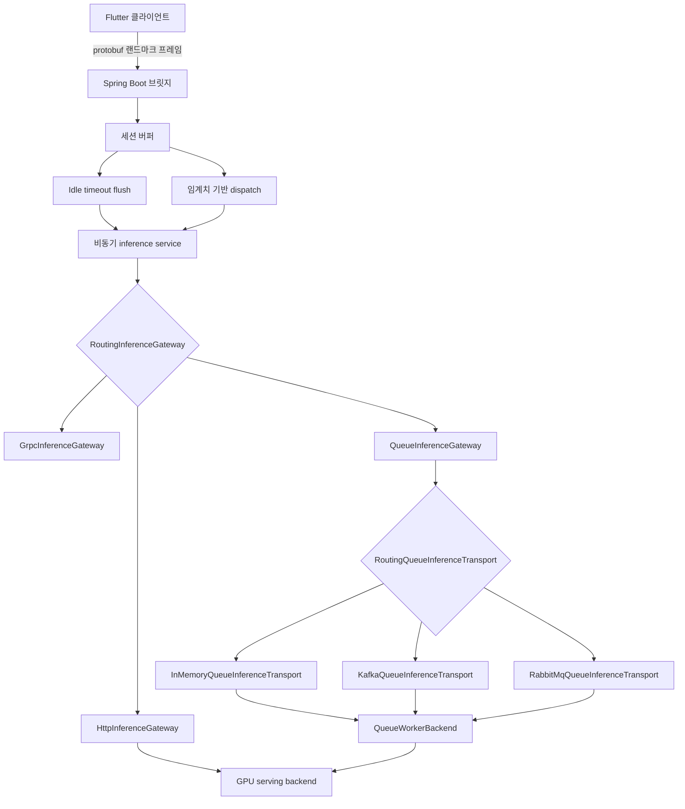

# 아키텍처 V2: 클라우드 수어 인식 브릿지

이 문서는 현재 저장소의 V2 구현 방향을 반영합니다. 프로젝트는 더 이상 순수 로컬 FFI 개념에 머무르지 않고, 비동기 버퍼링, provider 라우팅, queue 워커 계약, 운영 가시성을 갖춘 클라우드 브릿지 모델로 이동했습니다.

## 1. 현재 시스템 형태

## 2. 이미 구현된 내용

### 2.1 Spring 브릿지
- WebSocket 기반 protobuf landmark 수신
- 세션 단위 프레임 버퍼링
- idle timeout 기반 flush
- 세션별 in-flight 보호가 있는 비동기 추론 디스패치
- health, readiness, metrics 운영 endpoint

### 2.2 Inference Provider
- `http`
  실제 동작 경로, `HttpInferenceGateway` 사용
- `grpc`
  확장 포인트만 존재
- `queue`
  transport 라우터와 실행 가능한 in-memory 경로를 가진 활성 계약

### 2.3 Queue 워커 계약

Queue 경로는 명시적인 계약 객체들로 모델링되어 있습니다.

- `QueueInferenceTask`
  브릿지가 생성하는 작업 envelope
- `QueueInferenceTransport`
  queue transport 추상화
- `RoutingQueueInferenceTransport`
  `in-memory`, `kafka`, `rabbitmq` 선택기
- `QueueWorkerBackend`
  워커 측 처리 추상화
- `QueueInferenceResult`
  워커가 돌려주는 결과 envelope

즉, WebSocket/세션 레이어를 유지한 채 queue transport 구현만 교체할 수 있습니다. 저장소에는 이미 Kafka와 RabbitMQ용 skeleton transport가 포함되어 있습니다.

## 3. HTTP 서빙 계약

현재 활성 HTTP 서빙 인터페이스는 다음 계약으로 고정되어 있습니다.

- `GpuInferenceRequest`
  - `session_id`
  - `protobuf_b64`
  - `frame_count`
  - `transport`
  - `client_schema_version`
- `GpuInferenceResponse`
  - `session_id`
  - `text`
  - `is_final`
  - `confidence`
  - `processing_time_ms`
  - `model_version`
  - `error`

## 4. 운영 표면

브릿지는 이제 다음 endpoint를 제공합니다.

- `GET /internal/healthz`
  프로세스 liveness
- `GET /internal/readyz`
  GPU/backend readiness probe
- `GET /internal/metrics`
  런타임 gauge/counter 스냅샷

추적하는 메트릭 예시:

- 활성 WebSocket 세션 수
- 버퍼링 중인 세션 수와 프레임 수
- 진행 중인 inference 수
- 수신 메시지 수
- payload parse 오류 수
- dispatch 승인/거절 수
- 완료된 inference 수
- idle flush 발생 수

## 5. 설정 모델

브릿지는 `sign.gpu.*` 설정으로 서빙 경로를 선택하고 구성합니다.

- `sign.gpu.provider=http|grpc|queue`
- `sign.gpu.base-url`
- `sign.gpu.infer-path`
- `sign.gpu.health-path`
- `sign.gpu.grpc-target`
- `sign.gpu.queue-topic`
- `sign.gpu.queue-transport`
- `sign.gpu.queue-request-topic`
- `sign.gpu.queue-result-topic`
- `sign.gpu.queue-consumer-group`
- `sign.gpu.queue-exchange`
- `sign.gpu.queue-routing-key`
- `sign.gpu.queue-timeout-ms`

## 6. 다음 권장 작업

### 6.1 gRPC Provider
- 현재 스텁을 실제 gRPC 클라이언트로 교체
- 모델 백엔드용 protobuf 계약 정의
- channel pooling과 retry 정책 추가

### 6.2 Queue Provider
- Kafka 또는 RabbitMQ skeleton에 실제 브로커 클라이언트 연결
- producer/consumer factory, correlation ID, delivery semantics 추가
- request topic, result topic, consumer group, exchange, routing key를 실제 transport에 바인딩

### 6.3 로컬 실행 프로필
- `spring.profiles.active=kafka`
  `application-kafka.properties` 사용
- `spring.profiles.active=rabbitmq`
  `application-rabbitmq.properties` 사용
- 로컬 브로커 실행 파일:
  - `docker-compose.kafka.yml`
  - `docker-compose.rabbitmq.yml`
- 통합 로컬 스택 파일:
  - `docker-compose.stack.kafka.yml`
  - `docker-compose.stack.rabbitmq.yml`
- end-to-end queue 검증 스크립트:
  - `scripts/verify_kafka_stack.sh`
  - `scripts/verify_rabbitmq_stack.sh`

### 6.4 브로커 재시도 및 DLQ 샘플
- Kafka 샘플 정책 파일:
  - `sign_bridge/src/main/resources/application-kafka-dlq.properties`
- RabbitMQ 샘플 정책 파일:
  - `sign_bridge/src/main/resources/application-rabbitmq-dlq.properties`
- 샘플 파일에는 다음이 정리되어 있습니다.
  - retry topic 또는 queue 네이밍
  - dead-letter topic 또는 queue 네이밍
  - 최대 재시도 횟수와 backoff 값
  - 브로커 중심 재시도 흐름과 자주 함께 쓰는 listener 기본값

### 6.5 모델 서빙 연동
- `HttpGpuServingClient` 또는 향후 gRPC client를 실제 Sign-Gemma 서빙 계층에 연결
- model versioning과 backend 실패 분류 체계 정의
- auth, rate limiting, tracing 추가

## 7. 요약

V2는 더 이상 단순 제안 수준이 아닙니다. 브릿지 아키텍처의 상당 부분이 이미 구현되어 있습니다.

- 비동기 버퍼링
- timeout 기반 flush
- provider 라우팅
- queue 워커 계약
- 운영 endpoint

남은 일의 성격은 이제 “기초 아키텍처 설계”보다 “transport별 실제 구현과 운영 고도화”에 가깝습니다.
