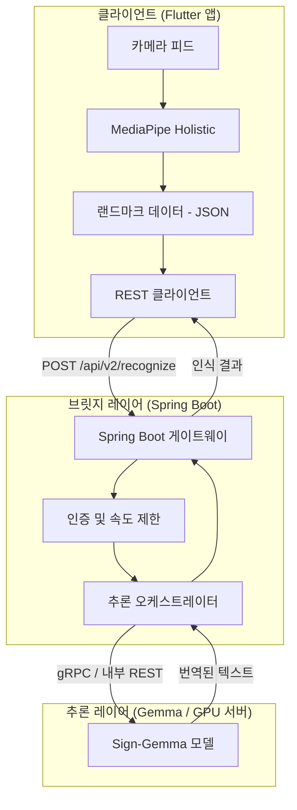

# 아키텍처 V2 제안서: 클라우드 기반 수어 인식 시스템 (Sign-Gemma & Spring Boot)

본 문서는 로컬 FFI 방식에서 Google의 **Sign-Gemma**와 **Spring Boot REST API** 브릿지를 활용한 클라우드 기반 추론 시스템으로의 전환 계획을 설명합니다.

## 1. 개요
새로운 아키텍처는 무거운 추론(Inference) 작업을 사용자 기기에서 강력한 GPU를 갖춘 클라우드 서버로 옮깁니다. 이를 통해 경량화된 TFLite 모델 대신, 훨씬 높은 번역 정확도를 제공하는 **Sign-Gemma**(Gemma 3/PaliGemma 제품군)와 같은 대규모 멀티모달 모델을 사용할 수 있습니다.

## 2. 제안 시스템 아키텍처

## 3. 아키텍처 비교

| 특징 | 아키텍처 V1 (FFI/로컬) | 아키텍처 V2 (Spring/클라우드) |
| :--- | :--- | :--- |
| **모델** | SignFormer-GCN (TFLite) | **Sign-Gemma** (Gemma 3 / 멀티모달) |
| **프로세서** | 모바일 CPU/NPU | **클라우드 GPU (T4/L4/H100)** |
| **메모리 점유** | < 500MB | **2GB - 8GB+** |
| **지연 시간** | < 50ms | **200ms - 800ms** (네트워크 영향) |
| **연결성** | 오프라인 지원 | **온라인 필수** |
| **정확도** | 높음 (패턴 기반) | **매우 뛰어남** (문맥적 이해) |

## 4. 타당성 분석

### 4.1. Sign-Gemma (네이티브 추론)
- **타당성:** **높음**. Gemma 3 멀티모달 모델은 시각적 랜드마크나 이미지 프레임을 직접 처리할 수 있습니다.
- **최적화:** 지연 시간을 줄이기 위해 원본 영상 대신 **MediaPipe를 통해 로컬에서 추출된 손 관절 데이터(Landmarks)**만 전송하는 것을 권장합니다. 이는 데이터 양을 MB 단위에서 KB 단위로 줄여줍니다.

### 4.2. Spring Boot 브릿지
- **타당성:** **매우 높음**.
- **역할:** Spring Boot는 다음과 같은 브릿지 기능을 제공합니다:
  - **API 표준화:** 깔끔한 REST/WebSocket 인터페이스 제공.
  - **비동기 처리:** UI 스레드를 차단하지 않고 긴 시간이 소요되는 모델 추론 처리.
  - **보안:** API 키 관리 및 사용자 컨텍스트 관리.

## 5. 기술적 해결 과제
1. **대역폭:** 고해상도 영상을 전송하면 사용자 경험이 저하됩니다.
   - *해결책:* Flutter 클라이언트에서 랜드마크만 추출하여 프레임당 543개의 좌표 포인트만 전송합니다.
2. **실시간성:** REST 방식은 실시간 스트리밍에 너무 느릴 수 있습니다.
   - *해결책:* Spring Boot에서 **WebSockets (STOMP)**을 사용하여 랜드마크 데이터와 결과 리턴을 양방향 스트림으로 처리합니다.

## 6. 구현 전략
1. **컨테이너화:** **Ollama** 또는 **vLLM**을 사용하여 Sign-Gemma 모델을 배포하고 확장성을 확보합니다.
2. **Spring 통합:** **Spring AI** (실험적 기능) 또는 `WebClient`를 사용하여 모델 서버에 요청을 프록시합니다.
3. **Flutter 클라이언트:** `slr_input_kit`의 구현 방식을 FFI에서 네트워크 기반(HTTP/WS)으로 전환합니다.
