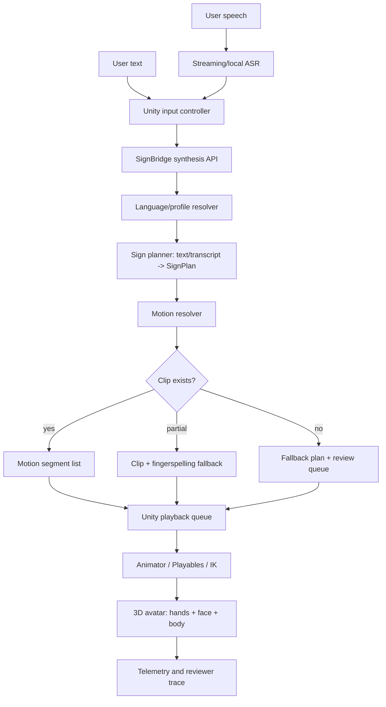
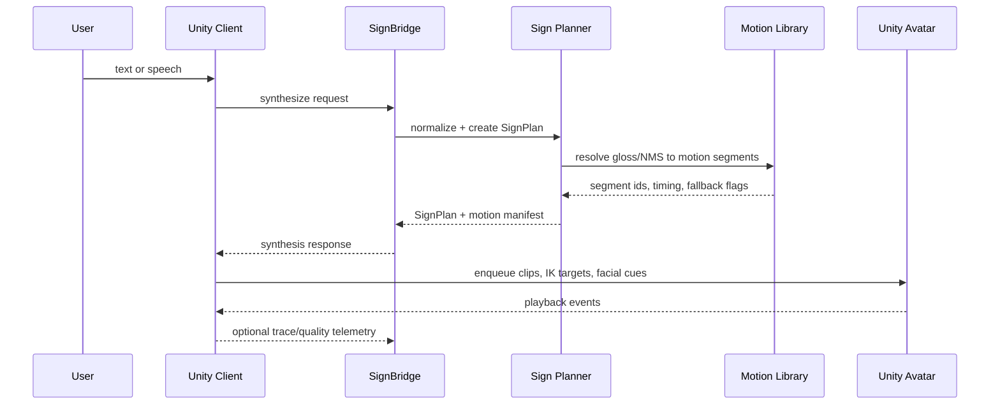

# Unity Sign Avatar Codex Automation Blueprint
> Created: 2026-05-23
> Purpose: Codex implementation blueprint

## 0. Goals and Deliverables

### Primary Goal
Unity 기반 실시간 수어 아바타 렌더링 시스템을 설계한다. `mj_sign`의 기존 SignBridge T2S/STS API와 모델 프로토콜을 유지하면서, text-to-sign 또는 speech-to-sign 결과를 Unity 3D 캐릭터 애니메이션으로 재생할 수 있는 제품/기술 계획을 문서화한다.

### Success Definition
- Text 입력 후 1차 MVP 기준 1초 이내에 첫 수어 동작 재생이 시작된다.
- Speech 입력은 streaming ASR 또는 chunk transcript를 통해 1.5초 이내에 첫 수어 동작 재생이 시작된다.
- Unity는 backend가 반환한 `SignPlan`, gloss sequence, timing, motion segment를 deterministic하게 재생한다.
- 검수된 motion clip이 있는 표현은 생성형 영상 모델보다 clip/rig 기반 아바타 렌더링을 우선 사용한다.
- 없는 표현은 fingerspelling, fallback gloss, 또는 human-review queue로 분기한다.

### Out of Scope
- Veo 2/3 같은 prompt-to-video 모델을 실시간 production renderer로 사용하는 것.
- 완전 자동 고품질 KSL 번역 모델을 1차 단계에서 완성하는 것.
- Deaf reviewer 없이 언어 품질을 production-ready로 선언하는 것.
- Unity 프로젝트의 전체 코드 구현.
- 실제 상용 ASR, T2S 생성 모델, 모션 캡처 파이프라인 구매/계약 결정.

## 1. Working Context

### Background
기존 `mj_sign`에는 `SIGN_SYNTHESIS_DESIGN_KO.md` 기준으로 T2S(Text-to-Sign), STS(Speech-to-Sign), `SignPlan + landmark motion` envelope, mock motion generator, Flutter/Web preview stub이 존재한다. 다음 단계는 landmark preview를 제품에 가까운 3D avatar playback으로 확장하는 것이다.

생성형 영상 모델은 영상 품질 데모에는 유용하지만, 실시간 대화형 수어에는 latency, 통제 가능성, 반복 재현성, 손가락/표정 정확도 문제가 크다. Unity 기반 3D 캐릭터는 motion clip, IK, blend tree, rig retargeting을 직접 제어할 수 있어 실시간성과 검수 가능성이 높다.

### Objective
Codex가 이후 구현 작업을 진행할 수 있도록 Unity client, SignBridge backend, planner/model service, motion asset pipeline, quality evaluation을 하나의 end-to-end 설계로 정리한다.

### Scope
- Included: Unity runtime architecture, SignBridge 연동, text/speech input flow, SignPlan schema 확장, motion clip library, fallback 정책, asset pipeline, MVP milestone, 검증 전략.
- Excluded: Unity C# 코드 본문, backend model training 코드, 상용 데이터 계약, 실제 3D 캐릭터 아트 제작.

### Inputs
| Item | Format | Source | Notes |
|---|---|---|---|
| Text input | UTF-8 string | User / app | KSL MVP는 `ko-KR`, `ksl` 기본값 |
| Speech input | audio stream or transcript chunk | User / ASR | MVP는 transcript 우선, audio는 ASR adapter로 확장 |
| Model profiles | JSON | `GET /api/v2/model-profiles` | locale, sign_language, model_profile 선택 |
| Sign synthesis request | JSON | Unity client | 기존 `POST /api/v2/sign/synthesize`, `POST /api/v2/speech/sign` 사용 |
| Motion library | Unity AnimationClip / metadata JSON | Asset pipeline | gloss, handshape, timing, NMS metadata 포함 |
| Reviewer feedback | CSV/JSON/Markdown | Human review | Deaf reviewer 검수 결과 |

### Outputs
| Item | Format | Destination | Notes |
|---|---|---|---|
| Unity sign playback | real-time 3D render | Unity scene | humanoid avatar + hand/finger rig |
| SignPlan cache | JSON | Unity local cache | 반복 문장/표현 latency 감소 |
| Motion playback trace | JSONL | `output/` or app telemetry | QA 및 회귀 테스트용 |
| Fallback report | JSON/Markdown | review queue | clip 미존재/품질 낮은 표현 수집 |
| Implementation tickets | Markdown | project docs/issues | milestone별 작업 분해 |

### Constraints
- 수어는 자연어이므로 gloss 단어 치환만으로 충분하지 않다. 어순, 공간 지시, 비수지 신호(NMS), 얼굴표정이 품질에 중요하다.
- Unity avatar는 손가락 rig 품질이 핵심이다. 일반 humanoid avatar보다 손 joint와 facial blendshape가 충분한 모델을 우선한다.
- 1차 MVP는 coverage보다 latency, 재현성, 검수 가능성을 우선한다.
- 생성형 영상 모델은 non-real-time demo, dataset augmentation, marketing video 용도로만 둔다.
- 개인정보가 포함된 음성/텍스트는 저장 정책, 익명화, 삭제 정책을 별도 정의해야 한다.
- KSL production 품질 판단에는 Deaf signer/reviewer 평가가 필요하다.

### Terms
| Term | Definition |
|---|---|
| T2S | Text-to-Sign. 텍스트를 수어 계획과 동작으로 변환 |
| STS | Speech-to-Sign. 음성을 transcript로 바꾼 뒤 수어로 변환 |
| Gloss | 수어 표현 단위의 중간 표기 |
| SignPlan | gloss, timing, NMS, spatial reference, fallback 정보를 담는 중간 계획 |
| NMS | Non-manual signals. 얼굴표정, 시선, 몸 방향 등 비수지 신호 |
| Motion clip | Unity AnimationClip 또는 외부 BVH/FBX에서 변환된 재생 가능한 동작 |
| Retargeting | motion data를 특정 avatar rig에 맞게 변환하는 과정 |
| Fingerspelling | 고유명사/미등록 단어를 지문자로 표현하는 fallback |

## 2. Workflow Definition

### End-to-End Flow
`Text/Speech Input -> ASR/Text Normalization -> Sign Planner -> Motion Resolver -> SignBridge Response -> Unity Motion Queue -> IK/Blend/Retargeting -> Avatar Rendering -> Telemetry/Review`





### LLM vs Code Boundary
| LLM handles | Code handles |
|---|---|
| 자연어 의도 해석, gloss 후보 생성, fallback 사유 설명, reviewer feedback 요약 | API 호출, schema validation, clip lookup, timing interpolation, Unity animation playback, telemetry 저장 |
| 문맥상 생략된 주어/목적어 추정 후보 생성 | deterministic tokenizer, ASR chunk buffering, profile routing |
| 품질 리포트에서 반복 실패 패턴 분류 | rig retargeting, IK solving, AnimationClip blending |

#### Step 01: Capture Input
1) Step Goal:
Unity에서 text 또는 speech input을 받아 synthesis request로 만들 준비를 한다.

2) Input / Output:
- Input: user text, microphone audio, selected language profile
- Output: normalized input event

3) LLM Decision Area:
입력 문장의 의도 보존이 필요한 경우 요약/정규화 후보를 제안할 수 있다.

4) Code Processing Area:
Unity UI input, microphone permission, audio chunking, profile selection, session id 생성.

5) Success Criteria:
session id, source type, locale, sign language, payload가 모두 채워진다.

6) Validation Method:
required field validation과 Unity client-side schema check.

7) Failure Handling:
microphone 권한 실패는 text input으로 안내한다. 빈 입력은 request를 보내지 않는다.

8) Skills / Scripts:
- Skill: none
- Script: none

9) Intermediate Artifact Rule:
`output/step01_capture_input.json`

#### Step 02: Resolve Speech To Transcript
1) Step Goal:
Speech input을 transcript chunk 또는 final transcript로 변환한다.

2) Input / Output:
- Input: audio stream or audio chunks
- Output: transcript with confidence and timestamps

3) LLM Decision Area:
ASR 결과가 모호한 경우 문맥 기반 후보를 정렬할 수 있다.

4) Code Processing Area:
ASR adapter 호출, chunk buffering, partial/final transcript 분리.

5) Success Criteria:
final 또는 usable partial transcript가 생성된다.

6) Validation Method:
confidence threshold, non-empty transcript, timestamp monotonicity 검사.

7) Failure Handling:
ASR 실패 시 재시도 1회 후 text input fallback 또는 사용자 재입력 요청.

8) Skills / Scripts:
- Skill: none
- Script: future `scripts/verify_asr_contract.py`

9) Intermediate Artifact Rule:
`output/step02_transcript.json`

#### Step 03: Plan Sign Expression
1) Step Goal:
text/transcript를 KSL/ASL 등 대상 수어의 SignPlan으로 변환한다.

2) Input / Output:
- Input: normalized text/transcript, profile
- Output: SignPlan with glosses, NMS, timing, spatial references

3) LLM Decision Area:
수어 gloss 후보, 의미 단위 분할, 생략/문맥 보정, fallback 설명 생성.

4) Code Processing Area:
profile routing, schema envelope 생성, known phrase dictionary lookup, validation.

5) Success Criteria:
SignPlan에 최소 1개 이상의 segment가 있고 profile metadata가 일치한다.

6) Validation Method:
JSON schema validation, glossary coverage check, reviewer-required flag 검사.

7) Failure Handling:
planner confidence가 낮으면 conservative gloss plan과 review flag를 반환한다.

8) Skills / Scripts:
- Skill: future `.agents/skills/sign-plan-review/`
- Script: future `scripts/validate_sign_plan.py`

9) Intermediate Artifact Rule:
`output/step03_sign_plan.json`

#### Step 04: Resolve Motion Segments
1) Step Goal:
SignPlan의 gloss/NMS/timing을 Unity에서 재생 가능한 motion manifest로 변환한다.

2) Input / Output:
- Input: SignPlan, motion library index
- Output: motion segment list with clip ids, IK targets, facial cues, fallback flags

3) LLM Decision Area:
미등록 표현의 fallback 우선순위 설명과 reviewer queue 요약.

4) Code Processing Area:
clip lookup, version compatibility check, interpolation timing, fingerspelling mapping.

5) Success Criteria:
각 segment가 `clip`, `fingerspell`, `skip-with-warning`, `review-required` 중 하나로 결정된다.

6) Validation Method:
motion library index schema, clip existence check, duration bounds check.

7) Failure Handling:
clip 누락 시 fingerspelling 또는 neutral placeholder로 대체하고 fallback report를 남긴다.

8) Skills / Scripts:
- Skill: future `.agents/skills/unity-motion-audit/`
- Script: future `scripts/build_motion_index.py`

9) Intermediate Artifact Rule:
`output/step04_motion_manifest.json`

#### Step 05: Stream Response To Unity
1) Step Goal:
SignBridge response를 Unity client가 빠르게 받을 수 있는 형태로 전달한다.

2) Input / Output:
- Input: SignPlan and motion manifest
- Output: HTTP response or streaming event sequence

3) LLM Decision Area:
없음. 이 단계는 deterministic transport가 맡는다.

4) Code Processing Area:
REST/WebSocket response, chunking, cache headers, protocol version normalization.

5) Success Criteria:
Unity가 첫 segment를 full response 대기 없이 enqueue할 수 있다.

6) Validation Method:
contract test, latency budget check, protocol version check.

7) Failure Handling:
stream 실패 시 REST full response fallback. protocol mismatch는 명시적 error envelope 반환.

8) Skills / Scripts:
- Skill: none
- Script: existing/future API smoke tests

9) Intermediate Artifact Rule:
`output/step05_bridge_response.json`

#### Step 06: Render Avatar In Unity
1) Step Goal:
Unity에서 motion segment를 실시간 3D avatar animation으로 재생한다.

2) Input / Output:
- Input: motion manifest, local AnimationClips, avatar rig
- Output: rendered avatar frames and playback events

3) LLM Decision Area:
없음. 단, QA 로그 설명 생성은 LLM이 후처리할 수 있다.

4) Code Processing Area:
Animator Controller, Playables API, Animation Rigging IK, facial blendshape control, clip blending.

5) Success Criteria:
첫 동작 start latency가 MVP 기준 1초 내외이고, 손/얼굴/몸 동작이 segment timing에 맞게 재생된다.

6) Validation Method:
Unity play mode tests, recorded playback trace, reviewer visual QA, frame timing telemetry.

7) Failure Handling:
clip load 실패 시 neutral idle과 error overlay를 표시하고 trace를 저장한다.

8) Skills / Scripts:
- Skill: future `.agents/skills/unity-playback-qa/`
- Script: future Unity play mode test runner

9) Intermediate Artifact Rule:
`output/step06_playback_trace.jsonl`

#### Step 07: Evaluate And Improve
1) Step Goal:
telemetry와 reviewer feedback을 모아 motion library와 planner를 개선한다.

2) Input / Output:
- Input: playback trace, fallback report, reviewer feedback
- Output: prioritized improvement backlog

3) LLM Decision Area:
실패 유형 clustering, reviewer comment 요약, 다음 clip 제작 우선순위 제안.

4) Code Processing Area:
metric aggregation, coverage 계산, regression fixture 생성.

5) Success Criteria:
coverage, latency, fallback rate, reviewer score가 release gate 기준으로 계산된다.

6) Validation Method:
dashboard metric check, fixture replay, human review sign-off.

7) Failure Handling:
품질 기준 미달 표현은 production route에서 제외하고 review queue로 되돌린다.

8) Skills / Scripts:
- Skill: future `.agents/skills/sign-quality-review/`
- Script: future `scripts/summarize_sign_quality.py`

9) Intermediate Artifact Rule:
`output/step07_quality_report.md`

### State Model
| State | Entry Condition | Exit Condition | Next State |
|---|---|---|---|
| `COLLECTING_REQUIREMENTS` | Unity avatar, 언어, latency, asset 정책이 확정되지 않음 | MVP 가정과 release gate가 문서화됨 | `PLANNING` |
| `PLANNING` | architecture와 milestone을 정리 중 | 구현 단위와 contract가 정리됨 | `RUNNING_SCRIPT` or `VALIDATING` |
| `RUNNING_SCRIPT` | schema validator, motion index builder, Unity test runner 실행 중 | script 성공 또는 실패 | `VALIDATING` or `FAILED` |
| `VALIDATING` | 문서, schema, playback trace를 검사 중 | 검증 결과 확인 | `DONE` or `NEEDS_USER_INPUT` or `FAILED` |
| `NEEDS_USER_INPUT` | avatar vendor, ASR provider, Deaf reviewer 기준 등 인간 결정 필요 | 사용자가 정책 결정 | `PLANNING` or `DONE` |
| `DONE` | 설계와 검증 기준이 수용됨 | Terminal | none |
| `FAILED` | 필수 입력/권한/asset 부재로 복구 불가 | Terminal | none |

## 3. Implementation Spec

### Recommended Folder Structure
```text
/project-root
  AGENTS.md
  blueprint-unity-sign-avatar.md
  SIGN_SYNTHESIS_DESIGN_KO.md
  MODEL_PROTOCOL.md
  /sign_bridge
  /unity_sign_avatar                 # future Unity project or package
    /Assets
      /MJSign
        /Runtime
          SignBridgeClient.cs
          SignPlaybackController.cs
          MotionManifest.cs
        /Animations
          /KSL
        /Avatars
        /Editor
    /Packages
    /ProjectSettings
  /.agents
    /skills
      /sign-plan-review
        SKILL.md
        /scripts
        /references
      /unity-motion-audit
        SKILL.md
        /scripts
        /references
      /unity-playback-qa
        SKILL.md
        /scripts
        /references
      /sign-quality-review
        SKILL.md
        /scripts
        /references
  /.codex
    /agents
  /output
  /scripts
```

### AGENTS.md Responsibilities
- Codex는 기존 SignBridge API/SPI를 우선 존중하고, Unity는 renderer/client boundary로 설계한다.
- 새 motion schema나 protocol 변경은 `SIGN_SYNTHESIS_DESIGN_KO.md`, `MODEL_PROTOCOL.md`, 이 blueprint의 contract와 함께 갱신한다.
- Unity 관련 작업은 avatar rig, animation clip, playback controller, telemetry를 분리해 구현한다.
- 언어 품질 관련 판단은 human review gate를 통과하기 전 production-ready로 표시하지 않는다.

### Custom Agent Definitions
| Name | Path | Role | Required Fields |
|---|---|---|---|
| none | none | 현재는 single Codex agent + skills/scripts로 충분하다. Unity 구현이 커지면 별도 custom agent보다 skill 분리를 먼저 검토한다. | none |

### Skill and Script Inventory
| Name | Type | Role | Trigger Condition |
|---|---|---|---|
| sign-plan-review | skill | SignPlan의 gloss, NMS, fallback flag 품질을 리뷰 | planner/schema 변경 또는 reviewer feedback 반영 |
| unity-motion-audit | skill | Unity motion library index, clip coverage, rig compatibility 점검 | 새 clip 추가, avatar 교체, release 전 |
| unity-playback-qa | skill | Unity playback trace와 시각 QA 체크리스트 관리 | playback controller 변경, latency regression 확인 |
| sign-quality-review | skill | reviewer feedback과 telemetry를 release gate로 요약 | milestone 종료, production 후보 평가 |
| scripts/validate_sign_plan.py | script | SignPlan JSON schema와 required fields 검사 | backend response contract test |
| scripts/build_motion_index.py | script | AnimationClip metadata를 검색 가능한 index로 생성 | motion library 업데이트 |
| scripts/summarize_sign_quality.py | script | fallback rate, coverage, reviewer score 요약 | QA 리포트 생성 |

### Skill Creation Rules

> 이 설계서에 정의된 모든 스킬은 구현 시 반드시 `skill-creator` 스킬(`/skill-creator`)을 사용하여 생성할 것.
> 직접 SKILL.md를 수동 작성하지 말 것 — 규격 불일치 및 트리거 실패의 원인이 됨.

skill-creator가 보장하는 규격:
1. SKILL.md frontmatter (`name`, `description`) 필수 필드 준수
2. `description`의 트리거 정확도 최적화 (eval 기반 optimization loop)
3. 스킬 저장 위치 `.agents/skills/<skill-name>/` 규격 준수
4. 폴더 구조 (`SKILL.md` + `scripts/` + `references/`) 규격 준수
5. Progressive disclosure: SKILL.md 본문 500줄 이내, 대용량 참조는 `references/`로 분리
6. 테스트 프롬프트 실행 및 품질 검증 완료

### Core Artifacts
| Path | Format | Producer | Purpose |
|---|---|---|---|
| `output/step01_capture_input.json` | JSON | Unity client | input/session/profile 확인 |
| `output/step02_transcript.json` | JSON | ASR adapter | speech transcript 검증 |
| `output/step03_sign_plan.json` | JSON | Sign planner | gloss/NMS/timing contract 검증 |
| `output/step04_motion_manifest.json` | JSON | Motion resolver | Unity playback manifest |
| `output/step05_bridge_response.json` | JSON | SignBridge | API response fixture |
| `output/step06_playback_trace.jsonl` | JSONL | Unity runtime | frame timing and playback events |
| `output/step07_quality_report.md` | Markdown | QA workflow | reviewer/telemetry summary |

### Unity Runtime Architecture
| Component | Responsibility | Notes |
|---|---|---|
| `SignBridgeClient` | REST/WebSocket synthesis API 호출 | existing SignBridge contract 유지 |
| `SynthesisSessionController` | text/speech session state와 cancellation 관리 | partial response 지원 |
| `MotionManifestParser` | response를 Unity playback queue로 변환 | schema version 검사 |
| `SignPlaybackController` | segment queue, preloading, transition 관리 | Playables API 권장 |
| `HandPoseController` | finger curl/spread, wrist orientation, IK target 제어 | Animation Rigging 패키지 후보 |
| `FacialNmsController` | facial blendshape, gaze, head/body cue 제어 | avatar별 mapping table 필요 |
| `FallbackController` | fingerspelling, unknown sign, neutral idle 처리 | fallback telemetry 기록 |
| `PlaybackTelemetry` | latency, missing clip, dropped segment 기록 | QA와 reviewer pipeline으로 전달 |

### Backend Contract Extension
기존 `signbridge-synthesis-v1` envelope는 유지하되 Unity renderer를 위해 `motion`에 manifest 형식을 추가한다.

```json
{
  "motion": {
    "format": "unity-motion-manifest",
    "fps": 30,
    "segments": [
      {
        "id": "seg-001",
        "gloss": "내일",
        "clip_id": "ksl.tomorrow.v1",
        "start_ms": 0,
        "duration_ms": 900,
        "transition_ms": 120,
        "nms": ["neutral"],
        "fallback": null
      }
    ]
  }
}
```

랜드마크 fallback과 Unity manifest를 함께 지원하려면 `output_format`을 `landmarks`, `unity-motion-manifest`, `both`로 확장한다.

### MVP Milestones
| Phase | Goal | Deliverable | Gate |
|---|---|---|---|
| M0 | 설계/contract 고정 | blueprint, motion manifest schema draft | 문서 리뷰 완료 |
| M1 | Unity local playback | 20~50개 KSL clip 재생, idle/transition/fingerspelling | 첫 동작 latency 1초 내외 |
| M2 | SignBridge 연동 | T2S API response를 Unity avatar가 재생 | contract tests 통과 |
| M3 | Speech flow | transcript 기반 STS, ASR adapter 연결 | speech 입력 후 1.5초 내외 |
| M4 | Quality loop | fallback report, reviewer checklist, coverage metric | reviewer score 기준 도입 |
| M5 | Expanded coverage | 자주 쓰는 도메인 phrase pack 추가 | fallback rate 목표 이하 |

### Key Technical Decisions
- Renderer는 Veo류 video generation이 아니라 Unity 3D avatar를 기본 경로로 둔다.
- Motion은 처음부터 완전 생성하지 않고, 검수된 clip library + blending + fingerspelling fallback으로 시작한다.
- Planner와 renderer의 경계는 `SignPlan`과 `unity-motion-manifest`로 고정한다.
- Unity는 translation judgment를 하지 않고, playback, blending, fallback visualization, telemetry에 집중한다.
- 향후 pose generation model은 `MotionResolver` 뒤에 추가하고, 검수된 clip을 대체하지 않고 coverage 확장용으로 사용한다.

## 4. Validation Checklist

- [ ] Every workflow step has all 9 required fields
- [ ] Intermediate artifacts use the `output/stepNN_<name>.<ext>` rule
- [ ] LLM vs code responsibilities are separated clearly
- [ ] Human review points are explicit where needed
- [ ] Codex skill paths use `.agents/skills/...`
- [ ] Codex custom subagents use `.codex/agents/*.toml`
- [ ] Skill additions or updates mention `skill-creator`
