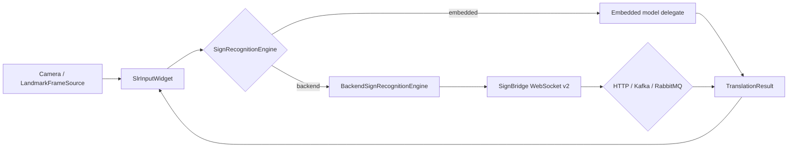

# SignBridge 이중 실행 모드 개선 설계

> 작성일: 2026-09-05  
> 대상: `sign/embedded`, `sign/backend`, `sign/common`, `sample/*`

## 1. 목표

하나의 수어 입력 API가 다음 두 실행 방식을 선택할 수 있게 한다.

1. **Embedded**: landmark를 네트워크로 내보내지 않고 앱 내부 모델로 인식한다.
2. **Backend**: landmark를 SignBridge Protocol v2로 보내 서버 모델로 인식한다.

두 방식은 입력과 결과 계약을 공유하고, 모델 runtime과 전송 방식만 교체한다.



## 2. 발견된 개선 포인트

| 우선순위 | 기존 문제 | 개선 결정 |
|---|---|---|
| P0 | `sign/embedded`가 실제로 WebSocket client에 직접 결합되어 내장 추론을 선택할 수 없음 | `SignRecognitionEngine`과 embedded/backend adapter를 도입한다. |
| P0 | `Dockerfile.real`의 `SIGN_USE_REAL_MODEL`과 Python의 `USE_REAL_MODEL`이 불일치 | 새 이름을 표준으로 읽고 기존 이름은 호환 fallback으로 유지한다. |
| P0 | Flutter client가 서버의 v2 구현과 달리 v1 protobuf만 송신 | sequence, chunk id, segment id, schema version, EOS를 송신한다. |
| P1 | 저장소에 검증된 SignGemma weight/API 연결이 없어 이름만으로 실제 모델처럼 보일 수 있음 | mock, demo delegate, real external adapter를 문서와 readiness에서 구분한다. |
| P1 | 로컬 모델의 동시 요청·메모리 사용 한도가 없음 | 엔진별 직렬 처리와 bounded pending queue를 둔다. |
| P1 | 서버/내장 결과를 위젯이 서로 다른 방식으로 처리할 가능성 | 두 adapter 모두 `SignRecognitionEvent`와 `TranslationResult`를 사용한다. |
| P1 | 내장형 샘플이 없음 | 동일 위젯에서 실행 모드를 전환하는 샘플을 제공한다. |
| P2 | 내장 모델 asset의 무결성·호환성 계약이 없음 | 후속으로 manifest, SHA-256, schema/model version 검증을 추가한다. |
| P2 | 실제 카메라·모델 품질 E2E가 mock 테스트와 섞임 | contract test와 실제 모델 acceptance test를 분리한다. |
| P2 | 분석 인덱스에 build 산출물이 포함될 수 있음 | 하네스에서 생성 디렉터리를 제외하고 CI에서 인덱스를 검증한다. |

## 3. 공통 API

`SignRecognitionEngine`은 다음 생명주기를 갖는다.

```text
stopped -> starting -> ready <-> processing
                         |          |
                         +-> error <-+
```

- `start()`: 모델 load 또는 WebSocket 연결
- `recognize(sessionId, frames, endOfSegment)`: frame batch 처리
- `endSegment(sessionId)`: 남은 문장 확정
- `stop()`: 자원과 stream 종료
- `events`: 상태, 오류, 공통 `TranslationResult` 전달

엔진을 호출하는 위젯은 모델 종류, HTTP, WebSocket 또는 native runtime을 알지
않는다. 앱이 엔진 인스턴스의 생성과 모델 자산 정책을 소유한다.

## 4. Embedded 설계

`EmbeddedSignRecognitionEngine`은 `EmbeddedRecognitionDelegate`를 호출한다.
delegate는 앱이 선택한 TFLite/Core ML/MediaPipe Tasks runtime을 캡슐화한다.

보안·개인정보 장점:

- landmark와 영상이 기기 밖으로 나가지 않는다.
- 네트워크 단절 상태에서도 동작할 수 있다.
- 서버 영상 보관 정책이 필요 없다.

제약:

- 앱 크기, RAM, 발열과 배터리 사용량이 증가한다.
- 플랫폼별 accelerator delegate 호환성 검증이 필요하다.
- 현재 저장소에는 검증된 SignGemma artifact가 연결되어 있지 않으며 샘플 delegate는 실제 수어 모델이 아니다.
- callback 내부의 네트워크 접근은 호스트 앱이 통제한다. SDK의 로컬 adapter 자체는 네트워크를 호출하지 않는다.

제품용 모델 bundle에는 다음 manifest가 필요하다.

```json
{
  "model_id": "provider/model",
  "model_version": "immutable-version",
  "input_schema": "mj.sign.ClientStreamChunk/v2",
  "sign_language": "ksl",
  "output_locale": "ko-KR",
  "sha256": "..."
}
```

## 5. Backend 설계

`BackendSignRecognitionEngine`은 `SignGemmaClient`를 감싸고 서버 결과를 공통
event로 바꾼다. 클라이언트는 Protocol v2 필드를 송신하며 `endSegment()`로 EOS를
명시한다. 서버 내부의 HTTP/Kafka/RabbitMQ 선택은 SDK에 노출하지 않는다.

운영 환경에서는 다음이 필수다.

- reverse proxy TLS와 `wss://`
- 단기 access token과 Origin allowlist
- 요청 크기/rate limit 및 세션 소유권
- 추론 queue, DLQ, 지연 및 drop metrics
- 영상 대신 landmark를 보내더라도 생체정보에 준하는 보관·삭제 정책

## 6. 폴더 구조

```text
sign/
  common/                         # canonical protobuf/evaluation fixtures
  embedded/                       # Flutter SDK and both client-side adapters
    lib/src/sign_recognition_engine.dart
    lib/src/sign_gemma_client.dart
    test/sign_recognition_engine_test.dart
  backend/bridge/                 # WebSocket, buffering, provider/queue routing
sample/
  embedded/flutter_app/
    lib/samples/dual_mode_recognition_sample.dart
    lib/dual_mode_main.dart        # flutter run -t lib/dual_mode_main.dart
  backend/model_server/           # mock and external real-model adapter
docs/
  DUAL_MODE_SIGN_RECOGNITION_DESIGN_KO.md
  embedded/
  backend/
```

## 7. 호환성과 마이그레이션

- 기존 `SlrInputWidget(bridgeUrl: ...)` 호출은 그대로 backend mode로 동작한다.
- 새 사용자는 `recognitionEngine`을 주입해 모드를 명시한다.
- `USE_REAL_MODEL`은 deprecated alias로 유지하고 `SIGN_USE_REAL_MODEL`을 표준으로 한다.
- Protobuf field는 삭제하거나 번호를 재사용하지 않는다.
- `model_profile=sign-gemma*`는 공식 모델이 연결되기 전까지 compatibility profile이다.
- 위젯에서 엔진 인스턴스를 교체할 때는 `ValueKey(mode)`처럼 key를 함께 교체한다.
- `stop()`은 엔진의 최종 종료다. 재사용하려면 새 엔진을 생성한다.

## 8. 테스트 전략

1. 공통 계약: protobuf 생성물이 canonical schema와 동기화되는지 검사한다.
2. Embedded unit: network 없이 결과 생성, 시작 전 거절, delegate 장애 후 회복, queue 제한, 추론 중 종료.
3. Backend unit: v2 envelope, EOS, event mapping, reconnect 한도.
4. Model server contract: invalid Base64/protobuf/session, real mode readiness.
5. Spring unit: buffer, validation, auth, queue correlation.
6. Integration: HTTP/Kafka/RabbitMQ v1/v2 probe.
7. Acceptance: 실제 수어 사용자 데이터는 동의·비식별화 후 언어별로 분리 평가한다.

## 9. 완료 기준과 남은 작업

이번 구현 완료 기준:

- 공통 엔진 API와 embedded/backend adapter가 컴파일된다.
- 기존 backend widget API가 유지된다.
- Flutter client가 Protocol v2 envelope와 EOS를 생성한다.
- dual-mode sample과 embedded unit test가 존재한다.
- real-model 환경변수가 Docker 설정과 일치한다.

외부 자산이 필요한 남은 작업:

- 공식 또는 자체 학습한 수어 인식 checkpoint
- 플랫폼별 실제 native delegate 구현
- KSL/ASL 사용자 참여 정확도·편향 평가
- 실기기 발열·메모리·배터리 benchmark
- 운영 TLS, identity provider 및 비밀 관리

## 10. 이전 검토의 주의점과 제품 적용 기준

- SignGemma preview 소개 글만으로 API 키 발급·모델 다운로드·지원 언어를 확정하지 않는다. 실제 artifact, 모델 카드, 라이선스, 입력 tensor 사양을 확보한 뒤 adapter를 연결한다.
- ASL과 KSL은 서로 다른 언어다. `ko-KR` 설정이나 프로필 이름은 한국수어 인식 성능을 보장하지 않는다. 수어 언어와 출력 언어를 각각 명시해야 한다.
- 현재 전송은 원본 영상 스트리밍이 아니라 **영상에서 추출한 landmark의 Protobuf 스트리밍**이다. RGB 영상을 요구하는 모델은 별도 입력 계약과 전처리가 필요하다.
- 현재 데모의 고정 결과와 confidence는 품질 측정치가 아니다. 실제 모델 결과에는 검증된 confidence/abstention 정책이 필요하다.
- 청각장애인 모두가 수어를 사용하지는 않는다. 수어 입력, 텍스트 수정, 재입력 및 수동 입력을 함께 제공하고, 인식 결과를 사용자가 확인한 뒤 입력창에 확정하도록 한다.
- 얼굴 표정·몸 움직임 같은 비수지 신호 손실, 손 가림, 조명, 카메라 방향, 언어별 차이를 평가에 포함한다. 실제 사용자 참여 평가는 별도 acceptance 단계다.

P2 manifest 검증과 실기기 모델 runtime은 이번 변경에 포함되지 않는다. 본 구현은 두 실행 경로의 SDK 경계, v2 전송, 수명주기, 데모 및 계약 검증을 제공한다.

## 11. 구현 검증 결과 (2026-09-05)

| 검증 | 결과 |
|---|---|
| Flutter SDK 정적 분석 / 엔진 단위 테스트 | 통과 / 5개 통과 |
| Flutter 샘플 정적 분석 / 위젯·서비스 테스트 | 통과 / 8개 통과 (이중 모드 화면 포함) |
| Python 모델 서버 계약 테스트 | 4개 통과 |
| Spring `./gradlew test` | 성공 (67개 기존 테스트 결과, Gradle up-to-date 재사용) |
| 웹 샘플 `npm run build` | 성공 |
| Docker HTTP 전체 스택 | 프로필 조회, 합성 API, WebSocket v1 결과, v2 ACK/EOS 통과 |
| Blueprint 구조 검사 / FILE_INDEX 동기화 / diff 공백 검사 | 통과 |

이번 실행에서 Kafka/RabbitMQ 컨테이너 통합 테스트와 실제 모델·실기기 품질 평가는 실행하지 않았다.
Docker 검증 스크립트는 종료 시 테스트 컨테이너와 네트워크를 정리하며 Colima는 실행 상태로 남는다.
