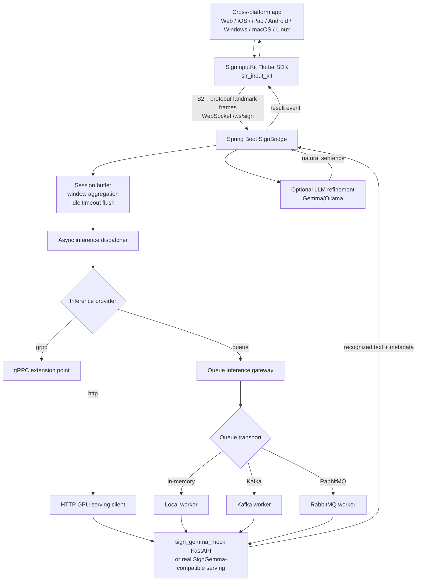
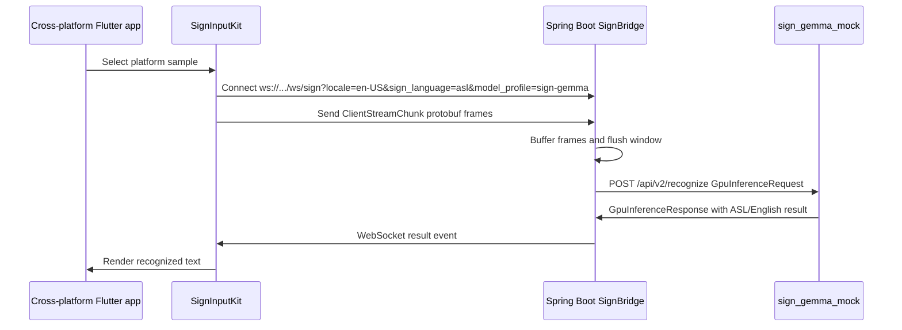
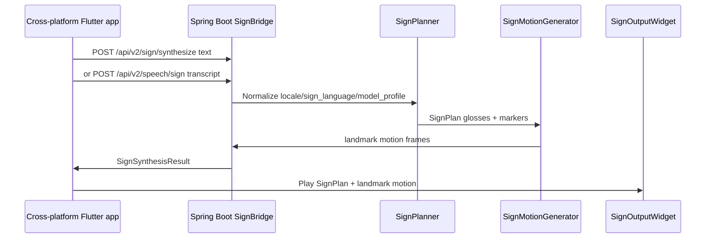
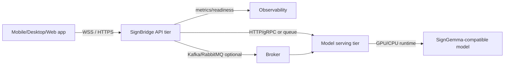

# SignBridge Project Architecture

This document is the shared architecture reference for LinguaSign, SignBridge,
and SignInputKit. Because official SignGemma checkpoints and input specs are
not publicly verified yet, the runnable demo uses the `sign-gemma` model profile
as a SignGemma-compatible ASL mock serving contract.

Korean version: [PROJECT_ARCHITECTURE_KO.md](./PROJECT_ARCHITECTURE_KO.md)

## System Overview

## SignGemma Demo Flow

## Text/Speech-to-Sign Flow

## Runtime Responsibilities

| Area | Responsibility | Current implementation | Replacement / extension point |
| --- | --- | --- | --- |
| App | Platform UI, camera permission, input and playback UX | Flutter sample gallery | Product app, kiosk, accessibility input |
| SignInputKit | WebSocket client, protobuf frame streaming, playback widget | `slr_input_kit` | Real camera landmark extractor |
| SignBridge | Sessions, buffering, routing, API/SPI, readiness/metrics | Spring Boot | Auth, tenant routing, operations policy |
| Model serving | S2T inference | `sign_gemma_mock` | Official SignGemma-compatible server |
| Synthesis | T2S/STS mock motion | `SignPlanner`, `MockSignMotionGenerator` | Real planner, avatar/skeleton renderer |
| Queue | Async inference transport | in-memory/Kafka/RabbitMQ skeleton | Production broker, DLQ, retry |
| LLM refinement | Raw keyword refinement | Gemma/Ollama SPI | Language-specific prompt/model policy |

## Deployment View

In local development, the app, Spring Boot bridge, and `sign_gemma_mock` can run
on one machine. In production, SignBridge and model serving should be separated
so GPU model servers or broker workers can scale independently.

## Verification Hooks

- `./scripts/verify_docker_http_stack.sh` builds the HTTP compose stack and
  verifies readiness, profile discovery, T2S, and WebSocket protobuf streaming.
- `./scripts/regenerate_protobuf.sh` regenerates Python and Flutter protobuf
  artifacts from `sign/common/schema/landmark.proto`; Spring Java output is generated by
  Gradle.
- `/swagger-ui.html` and `/v3/api-docs` expose OpenAPI examples for profile
  discovery, synthesis, readiness, health, and metrics.
