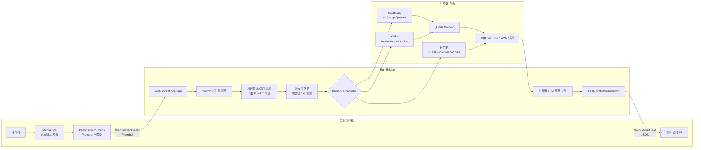
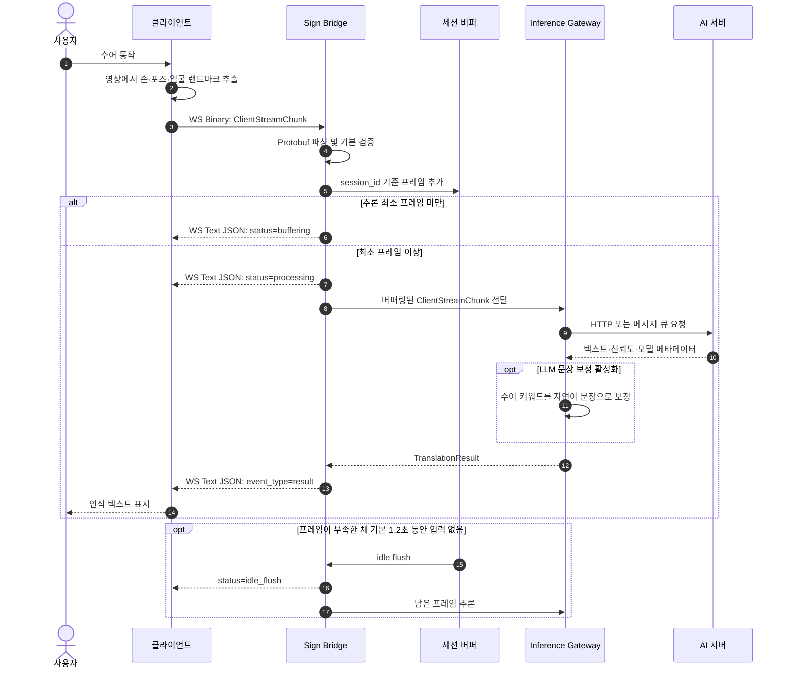
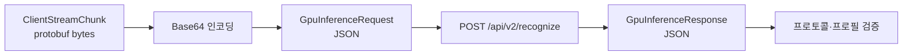
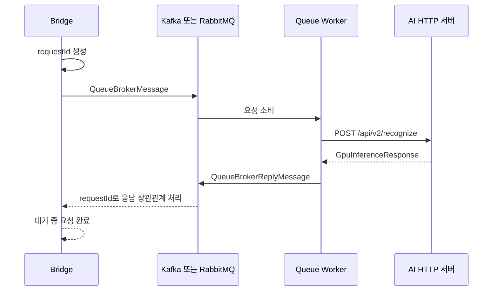
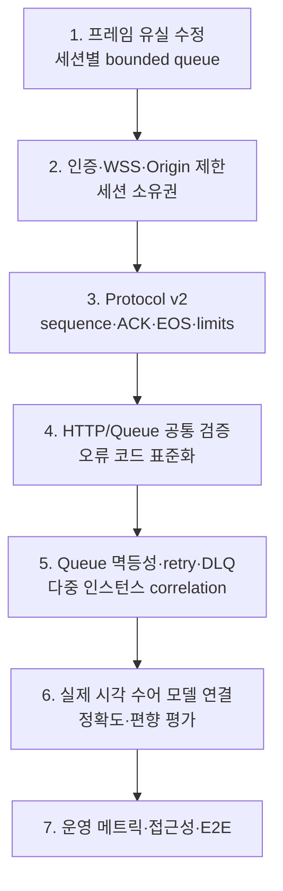

# 서버 스트리밍 수어 인식 구조와 프로토콜

## 1. 문서 목적

이 문서는 `sign/backend`, `sign/common`, `sample/backend`의 실제 구현을 기준으로 다음 내용을 설명한다.

- 클라이언트가 랜드마크 프레임을 서버로 스트리밍하는 과정
- Bridge가 HTTP, Kafka, RabbitMQ 중 하나를 통해 AI 서버를 호출하는 과정
- 클라이언트–Bridge 및 Bridge–AI 서버 사이의 현재 프로토콜
- 현재 구현에서 운영 서비스 전에 보완해야 할 부분

> 범위: 이 문서는 **서버 스트리밍 방식**을 다룬다. 기기 내장형 모델 방식은 `docs/embedded` 문서를 참고한다.

## 2. 한눈에 보는 전체 구조

핵심 설계는 클라이언트의 WebSocket 계약을 유지하면서, Bridge 뒤쪽의 추론 전송 방식을 교체할 수 있게 만든 것이다.



클라이언트는 내부 전송 방식이 HTTP인지 Kafka인지 알 필요가 없다. `sign.gpu.provider`와 `sign.gpu.queue-transport` 설정으로 Bridge 뒤쪽만 교체된다.

## 3. 정상 인식 시퀀스



현재 기본값:

| 항목 | 기본값 |
|---|---:|
| 추론 시작 최소 프레임 | 8 |
| 최대 버퍼 프레임 | 24 |
| 유휴 flush | 1,200ms |
| 세션 동시 추론 | 1개 |

## 4. 클라이언트–Bridge 프로토콜

### 4.1 WebSocket 연결

현재 엔드포인트:

```text
ws://<bridge-host>/ws/sign
```

프로필 선택용 쿼리 파라미터:

```text
/ws/sign?locale=ko-KR&sign_language=ksl&model_profile=sign-gemma-ko&protocol_version=signbridge-model-v1
```

| 파라미터 | 예 | 의미 |
|---|---|---|
| `locale` | `ko-KR` | 출력 자연어 로케일 |
| `sign_language` | `ksl` | 입력 수어 체계 |
| `model_profile` | `sign-gemma-ko` | 사용할 모델 프로필 |
| `protocol_version` | `signbridge-model-v1` | Bridge–AI 모델 계약 버전 |

운영 환경에서는 반드시 `wss://`를 사용하고 인증과 세션 소유권 검증을 추가해야 한다.

### 4.2 클라이언트 → Bridge

WebSocket **Binary Message**이며, canonical schema는 [`sign/common/schema/landmark.proto`](../../sign/common/schema/landmark.proto)이다.

```protobuf
message Point3D {
  float x = 1;
  float y = 2;
  float z = 3;
}

message LandmarkFrame {
  int64 timestamp_ms = 1;
  repeated Point3D left_hand = 2;
  repeated Point3D right_hand = 3;
  repeated Point3D pose = 4;
  repeated Point3D face_contour = 5;
}

message ClientStreamChunk {
  string session_id = 1;
  repeated LandmarkFrame frames = 2;
}
```

| 필드 | 현재 형식 | 목적 |
|---|---|---|
| `timestamp_ms` | `int64` | 프레임 촬영 시각 |
| `left_hand` | `Point3D[]` | 왼손 관절, 일반적으로 21점 |
| `right_hand` | `Point3D[]` | 오른손 관절, 일반적으로 21점 |
| `pose` | `Point3D[]` | 어깨·팔·상체 움직임 |
| `face_contour` | `Point3D[]` | 입·턱 등 비수지 표지 |
| `session_id` | 문자열 | 스트림 버퍼와 결과를 연결하는 식별자 |
| `frames` | 프레임 배열 | 한 메시지에 묶어 보내는 프레임 |

현재 Bridge는 빈 세션 ID, 빈 프레임, 최대 프레임 초과와 잘못된 Protobuf를 검사한다. 좌표 범위, 점 개수, timestamp 순서, 페이로드 바이트 크기는 검사하지 않는다.

### 4.3 Bridge → 클라이언트

서버 응답은 Protobuf가 아니라 WebSocket **Text Message의 JSON**이다.

상태 이벤트:

```json
{
  "session_id": "session-123",
  "event_type": "status",
  "status": "buffering",
  "status_text": "Buffering 4 frames before inference.",
  "is_final": false,
  "confidence": 0.0
}
```

| `status` | 의미 |
|---|---|
| `buffering` | 최소 추론 프레임까지 수집 중 |
| `processing` | 추론 요청을 시작함 |
| `idle_flush` | 입력 중단으로 남은 버퍼를 추론함 |
| `busy` | 같은 `session_id`의 추론이 이미 진행 중 |

결과 이벤트:

```json
{
  "session_id": "session-123",
  "event_type": "result",
  "result_text": "안녕하세요",
  "text": "안녕하세요",
  "is_final": true,
  "confidence": 0.94,
  "locale": "ko-KR",
  "sign_language": "ksl",
  "model_profile": "sign-gemma-ko",
  "protocol_version": "signbridge-model-v1"
}
```

`result_text`와 `text`는 현재 같은 값을 중복 제공한다. 하나를 canonical 필드로 정하고 다른 하나의 폐기 계획을 명시하는 것이 좋다.

오류 이벤트:

```json
{
  "session_id": "session-123",
  "event_type": "error",
  "error_code": "invalid-payload",
  "status_text": "Failed to parse protobuf payload.",
  "is_final": true,
  "confidence": 0.0
}
```

| 코드 | 발생 조건 |
|---|---|
| `unsupported-profile` | 지원하지 않는 로케일·수어·모델·버전 |
| `missing-session` | `session_id` 누락 |
| `empty-frames` | 프레임 없음 |
| `too-many-frames` | 한 청크의 프레임 수 초과 |
| `invalid-payload` | Protobuf 파싱 실패 |
| `inference-error` | 하위 추론 계층 오류 |

## 5. Bridge–AI 서버 프로토콜

### 5.1 HTTP 방식

Bridge는 `ClientStreamChunk`를 Base64로 변환해 JSON envelope에 넣는다.



요청:

```json
{
  "session_id": "session-123",
  "protobuf_b64": "<base64>",
  "frame_count": 8,
  "transport": "protobuf-b64",
  "client_schema_version": "v1",
  "protocol_version": "signbridge-model-v1",
  "locale": "ko-KR",
  "sign_language": "ksl",
  "model_profile": "sign-gemma-ko"
}
```

응답:

```json
{
  "session_id": "session-123",
  "text": "안녕하세요",
  "is_final": true,
  "confidence": 0.94,
  "processing_time_ms": 180,
  "model_version": "sign-gemma-ksl-v1",
  "protocol_version": "signbridge-model-v1",
  "locale": "ko-KR",
  "sign_language": "ksl",
  "model_profile": "sign-gemma-ko",
  "error": null
}
```

HTTP 경로는 응답의 프로토콜 버전과 프로필 메타데이터를 검증하고 confidence를 정규화한다.

### 5.2 Kafka 및 RabbitMQ 방식



`QueueBrokerMessage`:

| 필드 | 목적 |
|---|---|
| `requestId` | 요청과 응답의 상관관계 ID |
| `sessionId` | 클라이언트 스트림 ID |
| `requestTopic`, `resultTopic` | Kafka 토픽 또는 논리적 큐 이름 |
| `consumerGroup` | Kafka consumer group |
| `routingKey` | RabbitMQ routing key |
| `headers` | 확장 메타데이터 |
| `payload` | `GpuInferenceRequest` |
| `createdAt` | 요청 생성 시각 |

응답 메시지는 `requestId`, `sessionId`, `GpuInferenceResponse`를 가진다. Kafka와 RabbitMQ는 Bridge–AI 사이의 운반 방식만 바꾸며 클라이언트 WebSocket 계약은 동일하다.

### 5.3 gRPC 방식

설정과 `GrpcInferenceGateway` 클래스는 존재하지만 실제 원격 호출은 아직 구현되지 않았다. 현재는 confidence 0의 미구현 결과를 반환한다.

## 6. 구현상 잘된 부분

- 공통 Protobuf 스키마가 `sign/common`에 분리되어 있다.
- 클라이언트 계약과 내부 AI 전송 방식이 분리되어 있다.
- HTTP, Kafka, RabbitMQ 통합 테스트에서 실제 WebSocket 왕복이 검증된다.
- 로케일·수어·모델 프로필과 모델 프로토콜 버전을 전달한다.
- 최소 프레임 및 유휴 시간 기반 버퍼링이 구현되어 있다.
- 상태, 결과, 오류 이벤트가 `event_type`으로 구분된다.
- readiness, liveness, JSON 메트릭, Prometheus 메트릭이 제공된다.
- HTTP 모델 응답에 대한 프로토콜 검증이 존재한다.

## 7. 부족한 부분과 우선순위

### P0 — 서비스 정확성에 직접 영향

#### 7.1 추론 중 새 프레임 유실 가능성

버퍼가 최소 프레임에 도달하면 프레임을 먼저 버퍼에서 제거한다. 같은 세션의 이전 추론이 진행 중이면 dispatch는 거절되고 `busy`만 전송하므로 제거된 프레임이 유실될 수 있다.

권장 사항:

- 세션별 bounded inference queue 도입
- 버퍼 제거를 dispatch 승인 후로 이동
- 최신 프레임 유지 등 명시적인 drop policy 정의
- `busy` 이벤트에 `retry_after_ms`, `dropped_frames` 제공

#### 7.2 샘플 클라이언트의 랜드마크 부족

React 샘플은 현재 감지된 손의 손목 좌표 한 점만 `right_hand`로 전송한다. 양손 각 21점, pose, face contour가 빠져 실제 수어 인식 입력으로 부족하다. 프레임 루프도 React 상태 closure 때문에 시작 직후 종료될 가능성이 있다.

권장 사항:

- MediaPipe Holistic 또는 Hand + Pose + Face 조합
- handedness에 따라 왼손/오른손 분리
- 전체 손 관절과 상체·얼굴 특징 전송
- `useRef` 기반 카메라/RAF 생명주기 관리
- 랜드마크 매핑 단위 테스트와 카메라 E2E 테스트

#### 7.3 실제 AI 모델 연결은 계약 데모 수준

`USE_REAL_MODEL=true` 경로도 현재 랜드마크를 학습된 시각 모델에 입력하지 않고 고정 keyword hint를 프롬프트로 사용한다. 서버 계약은 검증할 수 있지만 실제 영상 기반 수어 인식 성능은 검증하지 못한다.

권장 사항:

- 랜드마크 시계열 encoder 및 학습 checkpoint 연결
- 데이터셋·수어 체계·평가 지표 명시
- 의미 정확도, 지연시간, 사용자군별 성능 측정

### P1 — 보안·확장성·프로토콜 신뢰성

#### 7.4 Origin 설정 무시

`allowedOriginPatterns` 설정을 주입하지만 실제 WebSocket 등록은 `*`를 하드코딩한다. 설정값 적용, 운영 wildcard 금지, WSS·인증·인가·rate limit이 필요하다.

#### 7.5 세션 ID 충돌과 격리 문제

버퍼와 in-flight 상태가 클라이언트가 지정한 `session_id` 하나로 전역 관리된다. 서버 발급 connection ID 또는 tenant/user ID와 결합한 내부 키와 세션 소유권 검증이 필요하다.

#### 7.6 스트리밍 신뢰성 필드 부족

현재 메시지에는 순번, 청크 ID, 세그먼트 종료, ACK, 재연결 복구 정보가 없다.

권장 v2 예:

```protobuf
message ClientStreamChunkV2 {
  string session_id = 1;
  repeated LandmarkFrame frames = 2;
  uint64 chunk_sequence = 3;
  string chunk_id = 4;
  string segment_id = 5;
  bool end_of_segment = 6;
  int64 sent_at_ms = 7;
  string schema_version = 8;
}
```

응답에는 `ack_sequence`, `accepted_frames`, `dropped_frames`, `retry_after_ms` 추가를 권장한다.

#### 7.7 Queue 응답 검증 불일치

HTTP 경로는 `ModelProtocolValidator`를 사용하지만 Queue 경로는 응답을 바로 변환한다. 공통 response mapper와 validator를 추출해 모든 transport에 동일한 contract test를 적용해야 한다.

#### 7.8 다중 Bridge 인스턴스 correlation

Queue 응답 대기 상태는 프로세스 메모리에만 있다. 요청을 보낸 Bridge와 결과를 소비한 Bridge가 다르면 원 요청을 완료하지 못할 수 있다. 인스턴스별 reply destination, partition affinity 또는 Redis 같은 공유 correlation store가 필요하다.

#### 7.9 재시도·DLQ·멱등성 미완성

DLQ 설정은 예시 수준이고 worker에 일관된 재시도·오류 분류·멱등성 정책이 없다. `requestId` 기반 멱등성, 지수 backoff, 최대 시도, DLQ replay 절차와 publish 결과 확인이 필요하다.

### P2 — 운영 품질과 개발 완성도

#### 7.10 페이로드 검증 부족

다음 제한과 검증을 프로토콜에 명시해야 한다.

- WebSocket 최대 바이너리 크기와 초당 메시지 제한
- 손·pose·face의 최대·최소 점 개수
- NaN/Infinity와 좌표 범위
- timestamp 단조 증가와 허용 시간 편차
- envelope와 Protobuf의 `session_id` 일치
- 엄격한 Base64 및 Protobuf 파싱

#### 7.11 동시 WebSocket 전송 보호

상태 메시지와 비동기 결과가 같은 세션에 동시에 `sendMessage`를 호출할 수 있다. `ConcurrentWebSocketSessionDecorator` 또는 세션별 outbound queue와 `event_sequence`가 필요하다.

#### 7.12 재연결·heartbeat·종료 규약

ping/pong 주기, 연결 timeout, exponential backoff, resume 가능 시간, `end_of_segment`, `cancel`, close 시 마지막 버퍼 처리 규칙이 필요하다.

#### 7.13 운영 메트릭

end-to-end latency histogram, provider/broker별 오류와 timeout, queue depth/consumer lag, dropped frame, busy, profile별 요청, 결과 전송 실패를 추가하는 것이 좋다.

#### 7.14 보안·접근성·모바일

- 샘플은 평문 `ws://`, `http://`를 사용한다.
- Kafka PLAINTEXT와 RabbitMQ `guest/guest` 관리 포트가 노출된다.
- iOS 카메라 사용 설명과 Android CAMERA 권한이 부족하다.
- icon-only 버튼의 접근성 이름과 결과 live region이 부족하다.
- “SSL ACTIVE” 표시는 실제 연결 상태와 일치하지 않는다.

샘플은 데모 전용임을 명확히 표시하고 운영 배포 설정과 분리해야 한다.

#### 7.15 자동화 테스트 공백

- malformed/oversized Protobuf와 Base64
- timestamp 역전, 점 개수 오류, session mismatch
- in-flight 연속 청크의 프레임 무손실
- reconnect/resume/backpressure
- HTTP/Kafka/RabbitMQ 공통 contract test
- broker 장애, retry, timeout, DLQ replay
- 다중 Bridge 인스턴스 correlation
- 실제 카메라와 모바일 권한 E2E
- 키보드·스크린리더·live region 접근성 테스트

## 8. 권장 개선 순서



Protocol v2에서 먼저 결정할 사항:

1. 좌표계, 정규화, 좌우 반전 및 handedness 기준
2. FPS, 청크 크기, 최대 바이트와 점 개수
3. 순서 번호와 중복 청크 처리
4. partial 결과의 수정·대체 규칙
5. segment 종료와 마지막 버퍼 처리
6. ACK, backpressure, drop policy
7. 재연결과 resume
8. typed error code와 재시도 가능 여부
9. 인증·권한·개인정보 보관 정책
10. 호환성, deprecated/reserved field 정책

## 9. 구현 근거 파일

- 공통 스키마: `sign/common/schema/landmark.proto`
- WebSocket: `WebSocketConfig.java`, `SignWebSocketHandler.java`
- 버퍼·비동기 처리: `SessionBufferService.java`, `AsyncInferenceService.java`
- provider routing: `RoutingInferenceGateway.java`
- HTTP/Queue: `HttpInferenceGateway.java`, `QueueInferenceGateway.java`
- Kafka/RabbitMQ: `SpringKafkaBrokerAdapter.java`, `SpringRabbitMqBrokerAdapter.java`
- 모델 서버 샘플: `sample/backend/model_server/main.py`
- React 샘플: `sample/backend/web_app/src/App.tsx`
- 클라이언트 서비스: `sample/backend/web_app/src/services/signService.ts`
- 통합 구성: `sample/backend/docker-compose.stack.*.yml`

## 10. 결론

현재 프로젝트는 WebSocket 입력과 AI provider를 분리하고 HTTP·Kafka·RabbitMQ 경로를 실제 통합 테스트할 수 있다는 점에서 좋은 기반을 갖추고 있다. 다만 현재 단계는 **프로토콜과 서버 전송 구조를 검증하는 데모/프레임워크**에 가깝다.

운영 가능한 수어 인식 서비스로 발전시키기 위한 최우선 과제:

1. 추론 중 프레임 유실 제거
2. 실제 전체 랜드마크와 학습된 시각 모델 연결
3. 인증·WSS·Origin·세션 격리 적용
4. sequence·ACK·종료·재연결을 포함한 Protocol v2 정의
