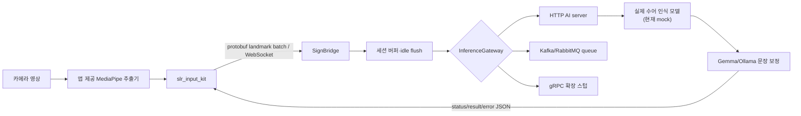

# AI 수어 입력 라이브러리 구현 검토 및 청각장애인 활용 제안

작성일: 2026-07-25  
검토 범위: `sign/embedded`, `sign/backend/bridge`, `sample/backend/model_server`, 공통 protobuf 및 핵심 아키텍처/API 문서

## 1. 결론

이 프로젝트는 **“마이크 입력처럼 재사용 가능한 수어 입력 SDK”라는 제품 방향이 명확하고, 서버 스트리밍 방식의 골격과 표준화는 잘 진행되어 있다.** 특히 Flutter 카메라 입력 추상화, protobuf landmark 전송, WebSocket 세션 버퍼링, 비동기 추론, HTTP/queue 라우팅, 모델 프로필 탐색 및 결과 이벤트 구조가 서로 연결되어 있으며 백엔드 단위·통합 테스트도 존재한다.

그러나 현재 상태를 두 기능으로 나누면 성숙도가 크게 다르다.

| 목표 기능 | 현재 판정 | 준비도 | 핵심 근거 |
|---|---|---:|---|
| 클라이언트 내장 AI가 직접 수어를 인식 | **설계/의존성 준비, 핵심 인식기는 미구현** | 25% | `tflite_flutter`, MediaPipe용 추상화는 있으나 영상·landmark를 수어 텍스트로 변환하는 온디바이스 모델 런타임과 공개 API가 없음 |
| 클라이언트가 AI 서버로 스트리밍하고 텍스트 수신 | **동작 가능한 프로토타입, 제품화 보강 필요** | 70% | WebSocket → 버퍼 → 추론 gateway → 표준 JSON 결과 흐름과 테스트가 구현됨 |

따라서 현 시점의 정확한 소개 문구는 다음과 같다.

> SignInputKit은 landmark 기반 수어 입력을 SignBridge로 스트리밍하고 표준화된 텍스트 결과를 받는 크로스플랫폼 프로토타입 SDK다. 온디바이스 수어 인식은 확장 지점과 일부 의존성만 준비되어 있으며 실제 시각 수어 모델 통합은 후속 개발 대상이다.

“Gemma 4를 내장해 수어를 직접 인식한다”는 표현은 아직 사용하면 안 된다. 현재 Gemma 계열 LLM은 주로 **인식 모델이 출력한 키워드를 자연스러운 문장으로 보정**하는 역할이며, `sample/backend/model_server`의 real 모드도 실제 landmark-to-text 시각 모델 대신 프로필에 정의된 키워드 힌트를 LLM에 전달한다.

## 2. 현재 구현 구조



현재 저장소에서 중요한 경계는 다음과 같다.

- 클라이언트 캡처: `LandmarkFrameSource`, `CameraLandmarkFrameSource`
- MediaPipe 연결점: `MediaPipeLandmarkFrameSource`
- 네트워크 클라이언트: `SignGemmaClient`
- 입력 UI: `SlrInputWidget`
- 공통 wire schema: `sign/common/schema/landmark.proto`
- WebSocket 수신 및 결과 이벤트: `SignWebSocketHandler`
- 세션 윈도잉: `SessionBufferService`
- 비동기 추론 및 LLM 보정: `AsyncInferenceService`
- 백엔드 교체 SPI: `InferenceGateway`
- 모델 서버 envelope: `GpuInferenceRequest`, `GpuInferenceResponse`
- 모델 프로필/언어 라우팅: `InferenceContext`, `SignLanguageResolver`

## 3. 기능 1 — 클라이언트 내장 AI 수어 인식 검토

### 잘 되어 있는 부분

- 카메라 생명주기와 landmark 추출기를 분리했다. 앱 또는 플랫폼 구현체가 `LandmarkFrameBatchExtractor`를 주입할 수 있다.
- 손·포즈·얼굴 윤곽을 공통 `LandmarkFrame`으로 표현하고 전면 카메라 좌우 반전을 지원한다.
- `tflite_flutter`, `mediapipe_core` 의존성이 선언되어 있어 모바일 추론 방향은 드러난다.
- 네트워크 인식과 캡처가 느슨하게 결합되어 향후 로컬 엔진을 추가하기 좋은 출발점이다.

### 부족하거나 오해를 부를 수 있는 부분

1. **온디바이스 인식 엔진 SPI가 없다.**
   `LandmarkFrameSource`의 출력은 곧바로 `SignGemmaClient`를 통해 서버로 전송된다. `recognize()`, `partialResults`, 모델 로딩, delegate 선택, warm-up 같은 로컬 추론 계약이 없다.

2. **실제 MediaPipe 추출기가 라이브러리에 포함되지 않는다.**
   `MediaPipeLandmarkFrameSource`는 이름과 달리 추출 함수를 호출하는 adapter다. hand/pose/face detector의 실제 초기화와 실행은 소비 앱이 제공해야 한다.

3. **Gemma는 시각 수어 인식 모델이 아니다.**
   현재 `GemmaService`는 텍스트 키워드를 문장으로 다듬는다. `sample/backend/model_server/sign_gemma_model.py`도 landmark tensor를 모델에 넣지 않고 텍스트 prompt를 생성한다.

4. **로컬/원격 모드의 통합 공개 API가 없다.**
   개발자는 하나의 입력 위젯에서 `onDevice`, `remote`, `hybrid`를 선택할 수 있어야 하지만 현재는 원격 WebSocket 중심이다.

5. **모델 배포 및 호환성 계약이 없다.**
   모델 파일 크기, checksum, signature, minimum app version, landmark schema, quantization, accelerator 지원, 라이선스 정보를 담는 manifest가 필요하다.

6. **클라이언트 테스트가 없다.**
   `sign/embedded/test`가 존재하지 않는다. 카메라 lifecycle, 좌우 반전, reconnect, 이벤트 parsing, 프레임 제한 및 로컬 추론 fallback을 검증해야 한다.

### 권장 구조

```dart
enum SignRecognitionMode { onDevice, remote, hybrid }

abstract interface class SignRecognitionEngine {
  Future<void> load(SignModelDescriptor model);
  Stream<SignRecognitionEvent> recognize(
    Stream<List<LandmarkFrame>> frames,
    SignRecognitionContext context,
  );
  Future<void> stop();
  Future<void> dispose();
}
```

권장 구현체:

- `TfliteSignRecognitionEngine`: landmark sequence → gloss/text
- `RemoteSignRecognitionEngine`: 기존 `SignGemmaClient`를 감싸는 구현
- `HybridSignRecognitionEngine`: 로컬 우선, 낮은 confidence나 미지원 언어만 서버 전환
- `SignTextRefiner`: 인식과 분리된 선택적 LLM 문장 보정기

중요한 원칙은 **시각 인식과 LLM 문장 보정을 별도 단계로 표현하는 것**이다. 그래야 정확도 측정, 장애 원인 분석, 개인정보 처리 및 모델 교체가 가능하다.

## 4. 기능 2 — 서버 스트리밍 수어 인식 검토

### 잘 되어 있는 부분

- binary WebSocket과 protobuf를 사용해 JSON 영상보다 작은 landmark batch를 전송한다.
- `session_id`, frame batch, timestamp, language/model profile을 전달한다.
- 최소 프레임, 최대 버퍼, idle flush, session별 in-flight 제한이 구현되어 있다.
- `status`, `result`, `error` 이벤트를 구분하고 confidence와 final 여부를 반환한다.
- HTTP, Kafka, RabbitMQ 및 확장용 gRPC gateway 경계가 존재한다.
- 모델 응답의 protocol/language/profile echo를 검증하고 confidence를 0~1로 정규화한다.
- readiness, metrics, model profile discovery와 관련 테스트가 있다.
- 백엔드 `./gradlew test`가 2026-07-25 기준 성공했다.

### 제품화 전에 필요한 보강

1. **스트림 제어 필드**
   현재 `ClientStreamChunk`에는 `session_id`와 frames만 있다. 아래 필드를 추가한 protocol v2가 필요하다.

   - `chunk_sequence`
   - `stream_started_at_ms`
   - `is_end_of_segment`
   - `is_end_of_stream`
   - `capture_fps`
   - `landmark_schema/profile`
   - `client_request_id`

2. **부분 결과와 교정**
   schema에는 `is_final`이 있지만 mock 프로필은 `supports_partial: false`이고 서버 흐름은 사실상 최종 결과 중심이다. `partial`, `replace`, `final` semantics 및 `revision` 번호를 정의해야 한다.

3. **흐름 제어와 손실 정책**
   서버가 느릴 때 클라이언트가 계속 frame을 보내는 상황에 대한 ACK, backpressure, drop 정책, 최대 대기시간이 없다. 최신 프레임 우선 또는 구간 단위 큐잉 정책을 문서화해야 한다.

4. **인증과 전송 보안**
   개발용 origin 제한은 있지만 사용자 인증, 권한, `wss`, 토큰 갱신, rate limit, tenant 격리 계약이 없다.

5. **개인정보 및 생체정보 보호**
   원본 영상을 서버로 보내지 않고 landmark를 보내는 점은 장점이지만 landmark도 개인을 식별하거나 민감한 동작을 재구성할 가능성이 있다. 명시적 동의, 목적 제한, 보존기간, 삭제, 로그 마스킹, 암호화 정책이 필요하다.

6. **세션 소유권**
   `session_id`가 클라이언트 제공 값이라 서로 다른 연결이 같은 ID를 사용할 수 있다. 인증 주체와 WebSocket 연결에 session을 bind하고 길이/문자 집합/충돌 정책을 검증해야 한다.

7. **오류 모델**
   추론 오류가 `TranslationResult.text`로 만들어진 뒤 prefix 검사로 error event가 되는 경로가 있다. 내부 결과 타입을 성공/실패로 분리하고 표준 error code, retryable, retry-after를 제공해야 한다.

8. **모델 mock의 정직한 구분**
   `USE_REAL_MODEL=true`도 현재 실제 수어 시각 인식이 아니다. `/ready` 응답에 `recognition_capability: mock|keyword_refiner|visual_sign_recognizer`와 `production_ready`를 노출해야 한다.

9. **구성/문서 일관성**
   코드 주석과 문서에는 Gemma 2가 주로 적혀 있지만 `application.yml`은 `gemma4:latest`를 사용한다. 특정 제품명을 아키텍처 계약에서 분리하고 실제 배포 모델은 설정/운영 문서에서만 명시하는 편이 안전하다.

## 5. 문서화 평가

### 강점

- `PROJECT_ARCHITECTURE.md`, `MODEL_PROTOCOL.md`, `API_SPI_REFERENCE.md`, `LANGUAGE_MODEL_GUIDE.md`로 관심사가 분리되어 있다.
- WebSocket URL, model envelope, profile discovery, 오류 처리 예시가 구체적이다.
- “공식 SignGemma checkpoint가 검증되지 않았고 mock 계약을 사용한다”는 문구가 핵심 영문 아키텍처 문서에 명시되어 있다.
- 실행 및 검증 스크립트가 문서에 연결되어 있다.

### 개선 항목

- 최상위 README 첫 화면에 두 모드의 구현 상태 표를 배치해야 한다.
- “내장 LLM”, “내장 수어 인식”, “LLM 보정”을 구분하는 용어집이 필요하다.
- 프로토콜 문서에 인증, 개인정보, rate limit, backpressure, 재연결 후 session 복구를 추가해야 한다.
- 정확도 지표를 전체 문장 하나로만 측정하지 말고 landmark extractor, gloss recognition, text refinement로 분리해야 한다.
- KSL/ASL 등 수어는 음성언어의 단순 변형이 아니므로 locale에서 수어를 자동 추정한 값은 hint로만 취급하고 사용자가 직접 선택·고정할 수 있음을 더 강조해야 한다.
- “지원 언어 목록”과 “실제로 검증된 모델 목록”을 분리해야 한다. 현재 profile route가 있다는 사실이 해당 수어 인식 모델의 존재를 의미하지 않는다.
- 릴리스별 protocol compatibility matrix, 모델 manifest 예시, 데이터 처리 흐름 및 위협 모델 문서를 추가해야 한다.

## 6. 청각장애인에게 제공할 수 있는 도움

이 라이브러리의 가장 큰 가치는 수어 인식을 별도 앱이 아니라 **일반 서비스의 입력 컴포넌트**로 만들 수 있다는 점이다.

### 우선 가치가 높은 사용 사례

1. **일반 입력창의 수어 버튼**
   채팅, 검색, 민원, 예약 화면에서 마이크 버튼 옆에 수어 버튼을 제공하고 인식 텍스트를 사용자가 확인·수정한 뒤 전송한다.

2. **병원·약국·공공기관 키오스크**
   증상, 요청, 본인 확인 절차를 수어로 입력하고 텍스트로 직원에게 전달한다. 의료·법률 결정은 자동 번역만으로 확정하지 않고 사람 통역 연결을 제공해야 한다.

3. **고객센터 비동기 문의**
   사용자가 수어 영상을 실시간 또는 짧은 구간으로 입력하고 상담원에게 텍스트와 원본 표현을 함께 전달한다.

4. **교육과 문해 지원**
   수어로 질문하면 교재 언어의 텍스트로 변환하고, 낮은 confidence 구간을 학습자에게 재확인시킨다.

5. **재난·안전 신고 보조**
   핵심 의도와 위치·상태를 빠르게 구조화하되, 오류 가능성을 명확히 표시하고 영상통역/문자 신고로 즉시 전환할 수 있어야 한다.

6. **오프라인·저연결 환경**
   온디바이스 모델이 완성되면 통신이 불안정하거나 개인정보 민감도가 높은 장소에서 기본 의사 표현을 처리할 수 있다.

### 반드시 지켜야 할 사용자 경험 원칙

- 번역 결과를 자동 전송하지 않고 사용자가 확인·수정·취소할 수 있게 한다.
- confidence 숫자만 보여주지 말고 “확실하지 않음—다시 표현하거나 직접 수정” 같은 행동 지침을 제공한다.
- 카메라가 켜졌는지, 서버 전송 중인지, 로컬 처리 중인지 항상 시각적으로 알린다.
- 손이 화면 밖에 있거나 조명·프레임이 부족할 때 실시간 촬영 품질 피드백을 준다.
- 수어 종류를 사용자가 직접 선택하고, 음성언어 locale로 수어를 단정하지 않는다.
- 수어 사용 당사자와 농문화 전문가가 데이터 수집, 평가 문장, 오류 분류 및 UI 검수에 참여한다.
- 청각장애인을 단일 집단으로 가정하지 않고 수어 사용자, 문자 선호 사용자, 난청 사용자별 선택지를 제공한다.
- 중요한 상황에서는 전문 수어통역사 연결을 대체하지 않고 보조한다.

## 7. 권장 개발 우선순위

### P0 — 제품 설명과 안전성 정리

- README에 구현 상태 표와 mock/real capability 표시
- “visual recognizer”와 “LLM refiner” 명칭 분리
- 인증, `wss`, session binding, 보존/삭제 정책 수립
- 서버 오류 결과 타입 표준화

### P1 — 두 모드의 공통 SDK 계약

- `SignRecognitionEngine` 및 `SignRecognitionMode` 도입
- 공통 `SignRecognitionEvent` 정의
- protocol v2의 sequence/EOS/partial/revision/backpressure 정의
- 클라이언트 unit/widget/integration test 추가

### P2 — 실제 모델 연결

- 실제 MediaPipe Tasks 기반 extractor 제공
- TFLite/ONNX 등 온디바이스 sequence recognizer 연결
- 실제 서버 visual recognizer를 mock과 분리
- 모델 manifest, checksum, signature, compatibility 검증

### P3 — 당사자 중심 품질 검증

- KSL 우선 평가 corpus와 동의 절차 수립
- signer-independent split로 평가
- WER/CER 외에 gloss accuracy, semantic accuracy, latency, abstention, subgroup 성능 측정
- 농인 사용자 테스트 및 접근성 감사

## 8. 출시 판단 기준

첫 공개 베타는 다음 조건을 만족한 뒤 권장한다.

- SDK 사용자가 동일한 입력 API로 local/remote를 선택할 수 있음
- 실제 visual recognizer가 mock과 기술적으로 분리되고 capability가 노출됨
- 인증된 `wss`와 데이터 보존·삭제 정책이 있음
- partial/final 및 stream 종료 semantics가 테스트됨
- 클라이언트와 서버의 reconnect, 중복 chunk, 순서 뒤바뀜, 서버 지연 테스트가 있음
- 검증된 수어/모델만 “지원”으로 표시됨
- 수어 사용자 당사자 평가와 고위험 상황 fallback이 마련됨

## 9. 검증 기록

- 백엔드: `cd sign/backend/bridge && ./gradlew test` 성공
- 클라이언트 샘플 테스트: `sample/embedded/flutter_app/test`에 배치
- 클라이언트 및 샘플 정적 분석: 새 경로 기준 `dart analyze` 성공
- Flutter 샘플 테스트: `cd sample/embedded/flutter_app && flutter test` 전체 통과
- 실제 카메라→실제 visual model→텍스트 end-to-end 정확도 검증 자료는 확인되지 않음
- 검토는 생성 코드와 플랫폼 보일러플레이트를 제외한 핵심 구현 및 문서를 기준으로 수행함
